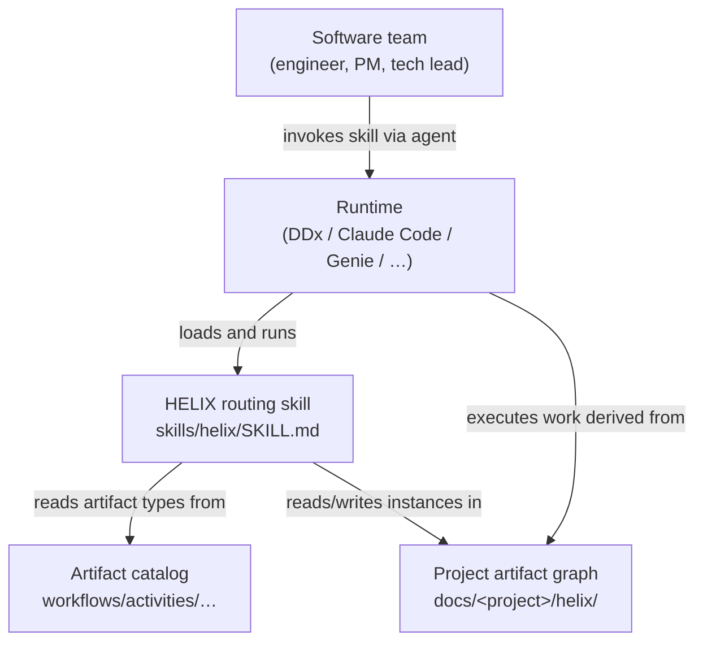
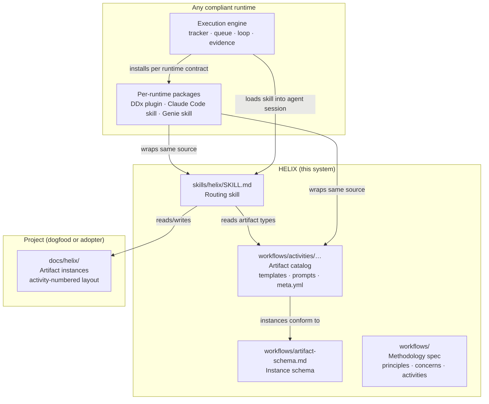

---
ddx:
  id: helix.architecture
  depends_on:
    - helix.prd
    - CONTRACT-003
  review:
    self_hash: 8b13992ac119f6bc4c1033f3af547203bfe96704172392d90a540f508ad62c4f
    deps:
      CONTRACT-003: 7c2fb59f847a930555679eed989233d20f23fe0896bcd50761bbeb4d77352010
      helix.prd: e11b46de6300cc84460245fcfd6739210ce38406a76f90e32d26685938302eb1
    reviewed_at: "2026-06-14T03:20:37Z"
---

# Architecture

HELIX is a methodology and artifact catalog for AI-assisted software teams. It
ships portable content and a single routing skill. Architecturally it is three
things:

1. An **artifact catalog** in `workflows/` — templates, prompts, metadata, and
   examples for every artifact type across the seven HELIX activities.
2. A **routing skill** in `skills/helix/SKILL.md` — the single agent-facing
   surface that reads and writes the catalog's artifact instances.
3. A **methodology specification** in `workflows/` — the artifact
   authority hierarchy, activity conventions, artifact-type schema,
   principles, flow contract, and workflow-mode contracts, expressed in
   runtime-neutral terms.

HELIX does not provide a CLI, tracker, queue, or execution loop. Those are
runtime concerns. The boundary between HELIX portable content and any
specific runtime is defined in
[CONTRACT-003](contracts/CONTRACT-003-ddx-adapter-boundary.md).

## Level 1: System Context



| Element | Type | Purpose |
|---------|------|---------|
| Software team | Human | Authors governing artifacts; approves plans; steers alignment |
| HELIX routing skill | This system | Single skill entry point: routing, alignment, planning, review |
| Artifact catalog | This system | Canonical artifact type definitions — templates, prompts, metadata |
| Project artifact graph | Per-project | Instances of HELIX artifact types for a specific project |
| Runtime | External | Executes skill sessions; owns tracker, queue, evidence, packaging |

The team never invokes a HELIX command, because there is not one. They invoke
their agent runtime, and the runtime invokes the HELIX routing skill.

## Vocabulary Contract

HELIX uses the following terms in the architecture and in the routing skill.
Keeping them separate prevents the marker, graph, catalog, and runtime
boundaries from collapsing into one overloaded "methodology" concept.

| Term | Meaning |
|------|---------|
| methodology | The portable HELIX content library: artifact catalog, graph, templates, prompts, workflow-mode contracts, and runtime-neutral rules. |
| flow | One active application of a methodology to a bounded project scope. A repo can run multiple flows at once, such as the core product flow and a microsite flow. |
| scope instance | The concrete root declared for one flow in `.helix.yml`, such as `docs/helix/` or `website/`. It bounds where the routing skill may read and write for that flow. |
| artifact instance | One project document authored from a catalog artifact type, carrying `ddx.id` and optional graph metadata in frontmatter. |
| domain lane | A domain-shaped flow specialization, such as product, web, infra, or data. A lane can use the same HELIX methodology while selecting different concerns and handoff rules. |
| workflow mode | A behavior inside the public `helix` skill, such as `frame`, `align`, `validate`, `evolve`, `design`, `polish`, or `review`. Modes are not separate public skills. |
| public skill | `skills/helix/SKILL.md`, the single operator-facing entry point that resolves the active flow, then dispatches to a workflow mode. |

The marker file governs active scope. In the current marker schema,
`helix_version: 2` uses `flows:` as the canonical key:

```yaml
helix_version: 2
flows:
  - id: helix
    instance: product
    root: docs/helix/
  - id: helix
    instance: microsite
    root: website/
defaults:
  flow: helix:product
```

`methodologies:` is the legacy marker key. Parsers may accept it for migration
compatibility, but new markers use `flows:` because a methodology may be
applied through more than one active flow.

The generated catalog graph intentionally still uses a singular
`methodology:` key. That key identifies the library that graph nodes come
from, not an active project scope. Graph nodes use `library:<slug>` for
catalog-owned artifact types and may use `local:<slug>` for project-local
types. Cross-flow edges live in `external_edges:` and must be mirrored by
instance frontmatter with `cross_flow: true`; `cross_methodology: true` is a
legacy alias accepted only for migration.

Colon-qualified IDs carry this same distinction:

- `library:prd` means the PRD artifact type from the HELIX catalog.
- `local:launch-checklist` means a project-local artifact type.
- `helix:product:PRD-001` means an artifact instance in the `helix` product
  flow.
- `helix:microsite:DESIGN-001` means an artifact instance in the `helix`
  microsite flow.

Within a flow, ordinary `ddx.depends_on` links are same-scope links.
Cross-scope links connect two instances of the same methodology in different
roots. Cross-lane links connect different domain lanes, such as product to
infra. Both are cross-flow links in the marker and graph contract; the domain
name only clarifies why the link crosses a boundary.

## Level 2: Container Diagram



| Container | Technology | Responsibilities |
|-----------|------------|-----------------|
| `skills/helix/SKILL.md` | Markdown (skill frontmatter + body) | Single agent-facing surface; all workflow modes; resolves active flows; reads/writes artifact instances |
| `workflows/activities/` | Markdown + YAML | Artifact type definitions: template, prompt, meta.yml, example per type |
| `workflows/artifact-schema.md` | Markdown spec | Normative schema for `meta.yml` and `ddx:` instance frontmatter |
| `workflows/` (non-activity dirs) | Markdown | Methodology spec: principles, concerns, activity contracts, alignment guidance |
| `docs/helix/` | Markdown + YAML | Project artifact instances; authored from catalog templates |
| Per-runtime packages | Runtime-specific metadata | Thin wrappers that expose same source to DDx, Claude Code, Genie |
| Runtime execution engine | Runtime-specific | Tracker, queue, loop, evidence — outside HELIX boundary |

## Artifact Catalog

The artifact catalog is HELIX's primary structural element. It defines every
artifact type a HELIX-governed project may produce, organized by the seven
HELIX activities:

| Activity | Activity slug | Typical artifact types |
|----------|-----------|------------------------|
| Discover | `00-discover` | Product vision, opportunity brief, constraints |
| Frame | `01-frame` | PRD, feature specs, user stories, risks |
| Design | `02-design` | Architecture, ADRs, solution designs, technical designs, contracts |
| Test | `03-test` | Test plans, test strategies, acceptance criteria |
| Build | `04-build` | Implementation plans, execution documents |
| Deploy | `05-deploy` | Release plans, operations runbooks, rollout docs |
| Iterate | `06-iterate` | Alignment reviews, metrics, retrospectives |

Each artifact type in the catalog provides four files:

| File | Purpose |
|------|---------|
| `meta.yml` | Artifact-type metadata per the artifact schema |
| `template.md` | Markdown skeleton for new instances |
| `prompt.md` | Authoring guidance for agents or humans |
| `example.md` | Canonical illustrative instance |

The full `meta.yml` schema — required fields, recommended fields, validation
entries, id-format, dependency declarations, and extension sections — is
specified in [`workflows/artifact-schema.md`](../../../workflows/artifact-schema.md).

### Authority hierarchy

Every artifact type declares its position in the artifact authority
hierarchy. Higher-level artifacts govern lower-level ones; conflicts
resolve upward:

```
product vision
  └─ PRD
       └─ feature specs / user stories
            └─ architecture · ADRs
                 └─ solution designs · technical designs
                      └─ test plans
                           └─ implementation plans · code
```

The routing skill's `evolve` workflow mode threads changes downward through
this order; `align` audits consistency across it. The authority hierarchy is a
HELIX invariant; runtimes execute against it but do not redefine it.

### Artifact instance frontmatter

Project artifact instances carry YAML frontmatter under the `ddx:` key. The
namespace is historical (DDx is the reference consumer); it does not mean
artifacts require DDx. Minimal instance frontmatter:

```yaml
---
ddx:
  id: FEAT-001
  type: feature-spec
  depends_on:
    - helix.prd
  status: draft
---
```

`ddx.id` is the only required field. `ddx.depends_on` builds the traceability
graph the routing skill traverses inside the active flow. Cross-flow
relationships use the marker and graph contract described above. Full field
definitions are in
[`workflows/artifact-schema.md`](../../../workflows/artifact-schema.md).

## Routing Skill

`skills/helix/SKILL.md` is the single agent-facing surface. Any runtime that
loads the skill exposes the same capability set.

### What the skill reads and writes

| Reads | Writes |
|-------|--------|
| Artifact catalog (`workflows/activities/…`) — type definitions, templates, prompts | Project artifact instances (`docs/helix/…`) — new or updated content |
| Project artifact instances — current state of the dependency graph | Alignment reports, work-item descriptions, design documents |
| Methodology docs (`workflows/`) — principles, concerns, activity contracts | Follow-up work descriptions (runtime surfaces these as tracker items, GitHub issues, or markdown stubs) |

The skill never writes to a tracker, queue, or evidence store. Those are runtime
responsibilities.

### Workflow Modes

| Mode | Purpose |
|------|---------|
| `input` | Convert rough intent into governed work |
| `frame` | Create or refine vision, PRD, feature specs, user stories |
| `align` | Identify drift, gaps, and contradictions across the artifact graph |
| `validate` | Check one artifact instance against its type template and prompt |
| `evolve` | Thread a changed requirement through the authority hierarchy |
| `design` | Author a technical design before implementation |
| `backfill` | Reconstruct missing artifacts from evidence |
| `review` | Fresh-eyes review of plans, PRs, or recent work |
| `polish` | Refine work items for execution readiness |
| `check` / `next` | Decide the safe next action when intent is ambiguous |
| `build` / `run` | Bounded implementation pass or operator loop (delegates to runtime) |
| `commit` | Commit verified work with traceable message |
| `release` | Cut a HELIX content release |

### Skill composability

The routing skill reads the artifact catalog when a workflow mode needs a
template, prompt, or quality rule; it does not bundle
catalog content inside the skill body. This means:

- Any runtime that installs the HELIX package exposes the same workflow modes.
- Catalog updates (new artifact types, revised templates) take effect without
  changing the skill body.
- The skill body contains zero runtime-specific commands (PRD R-4). Per-runtime
  packaging notes live in `docs/install/<runtime>.md`.

The skill's normative behavior is self-contained. Runtimes may surface
additional affordances through their own packaging layers, such as work-item
authoring, queue execution, evidence capture, or prose checking. Those
extensions are runtime behavior, not HELIX specification state, and they do not
belong in the skill body.

## Artifact Schema as Runtime Contract

[`workflows/artifact-schema.md`](../../../workflows/artifact-schema.md)
is the contract that lets any compliant runtime register and consume HELIX
artifact types and artifact instances. A runtime claiming HELIX compatibility
must:

1. Read `meta.yml` for artifact-type metadata.
2. Resolve `ddx.id` and `ddx.depends_on` in instance frontmatter for graph
   traversal.
3. Treat `workflows/artifact-schema.md` as the schema authority — not its own
   internal documentation.
4. Preserve unknown fields rather than stripping them.

The schema is intentionally open. Runtimes may add extension fields under
`ddx:` for operational state, but those fields must be ignorable by other
runtimes without changing artifact meaning. Specification fields state
artifact intent, relationships, and constraints; runtime operational fields
record execution details for that runtime.

Minimum runtime primitives required to run the routing skill:

1. Read markdown files from the project filesystem.
2. Write markdown files to the project filesystem.
3. Search files by path or pattern.

Shell execution is optional. A runtime satisfying only items 1-3 can run every
HELIX workflow mode that does not involve direct code execution.

## Scripts, Runtime Behavior, And Specifications

HELIX's product surface is documents plus the public routing skill. Repository
scripts are ancillary helpers for maintaining or packaging that content. They
may generate reference pages, publish dogfood artifacts into the microsite, or
validate catalog consistency, but they are not an operator-facing HELIX CLI and
they do not define methodology behavior.

Runtime behavior belongs to the runtime. A runtime may provide a tracker, queue,
execution loop, evidence store, sandbox, model router, or installer. HELIX can
describe the artifact handoff those runtime features must honor, but the
runtime owns the concrete mechanism.

Specifications capture intended behavior and constraints. They do not track
whether a particular script, package, or runtime adapter has already caught up
to that intent. Gaps between intent and current code are tracked as work items,
review findings, or release notes outside the specification body.

## Packaging

HELIX ships as three distribution packages around the same source content
(PRD R-7). The source in `workflows/` and `skills/helix/` is never forked.

| Package | Target runtime | Format | Install |
|---------|---------------|--------|---------|
| DDx plugin | DDx | DDx plugin manifest + catalog layout under `.ddx/plugins/helix/` | `ddx install helix` |
| Claude Code skill | Claude Code | Skill frontmatter + symlinked content under `.claude/skills/` | Copy or symlink |
| Databricks Genie skill | Databricks Genie | Genie skill descriptor + bundled catalog | Genie skill loader |

Per-runtime packaging notes — install paths, invocation details, DDx-specific
bead conventions, Genie-specific descriptor fields — live in `docs/install/`.
None of that detail appears in the routing skill body or the artifact catalog.

The adapter boundary between HELIX portable content and DDx-specific surfaces is
specified in [CONTRACT-003](contracts/CONTRACT-003-ddx-adapter-boundary.md).
DDx is one reference runtime, not the architecture center.

## Documentation Projection

HELIX maintains two complementary documentation trees:

| Tree | Role |
|------|------|
| `workflows/` | Methodology specification — artifact-type schema, activity contracts, principles, concerns, alignment guidance. This is the normative content. |
| `docs/helix/` | Dogfood — HELIX's own governing artifacts, authored from HELIX templates. The dogfood is itself subject to `align` workflow-mode runs. |

`workflows/` is what adopters install; `docs/helix/` demonstrates the
methodology applied to HELIX's own development. The Hugo microsite (when
generated) is a read-only projection of both trees, not a source of truth.

Methodology invariants — principles, ratchets, activity contracts — are
maintained in `workflows/principles.md` and `workflows/ratchets.md`. Before
relying on either for design decisions, verify the current state in the file;
both are in active flux.

## DDx as One Reference Runtime

DDx is the reference runtime for HELIX's own development. HELIX uses DDx for
bead tracking, ddx work dispatch, and execution evidence on its own work
items. This is HELIX-using-DDx, not HELIX-coupled-to-DDx — the same
relationship any adopter has with their chosen runtime.

The DDx adapter boundary is defined in
[CONTRACT-003](contracts/CONTRACT-003-ddx-adapter-boundary.md). In brief:

- HELIX provides to DDx: artifact catalog, routing skill, artifact-type schema.
- DDx provides to HELIX (as runtime): bead tracker, ddx work, evidence
  store, plugin packaging, prose checker.
- Neither side owns the other's internals.

CONTRACT-003 also catalogs known boundary leaks — places in the current
codebase where runtime-specific language has crept into HELIX portable content —
and describes the resolution for each.

## Quality Attributes

| Attribute | Strategy |
|-----------|---------|
| Runtime portability | Skill body and catalog contain zero runtime-specific commands; portability check on every release (PRD R-4) |
| Authority-hierarchy coherence | `align` mode audits consistency; `evolve` mode propagates change from the highest-authority artifact down |
| Catalog completeness | Seven-activity coverage; each type has template, prompt, meta, example |
| Self-application | `docs/helix/` is authored from HELIX templates; `align` workflow-mode runs catch dogfood drift (PRD R-6) |
| Schema openness | Consumers add extension fields; unknown fields are preserved, not stripped |
| Distribution breadth | Three packaging targets (DDx, Claude Code, Genie); source never forked (PRD R-7) |

## References

- [Product Vision](../00-discover/product-vision.md)
- [PRD](../01-frame/prd.md) — especially R-4 (runtime-neutral), R-5 (methodology spec), R-7 (packaging)
- [CONTRACT-003: DDx Adapter Boundary](contracts/CONTRACT-003-ddx-adapter-boundary.md) — the boundary between HELIX and DDx
- [Artifact Schema](../../../workflows/artifact-schema.md) — normative schema for `meta.yml` and `ddx:` frontmatter
- [Routing Skill](../../../skills/helix/SKILL.md) — the single agent-facing surface
- [workflows/principles.md](../../../workflows/principles.md)
- [workflows/ratchets.md](../../../workflows/ratchets.md)
