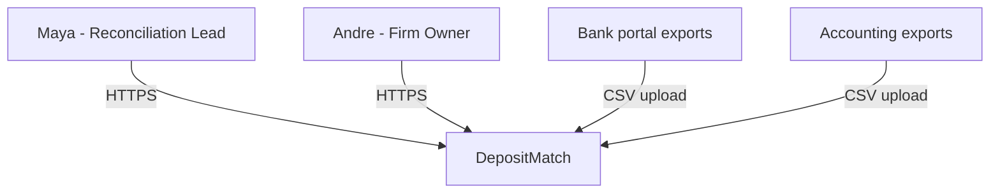
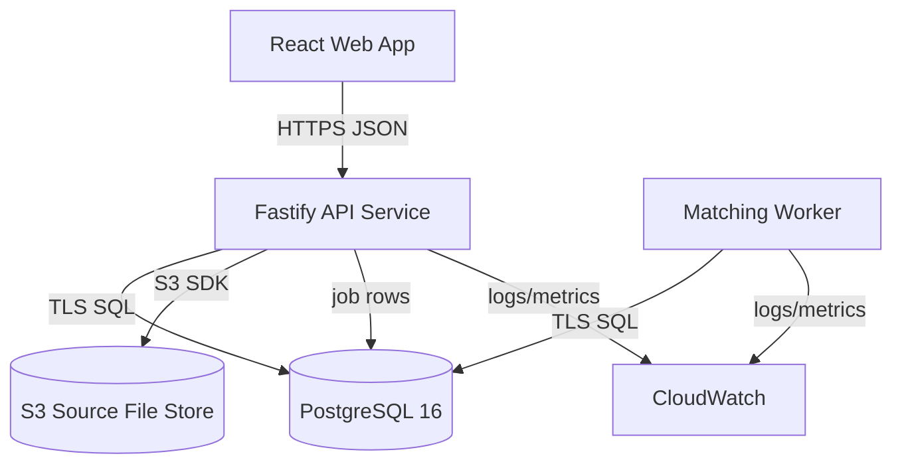
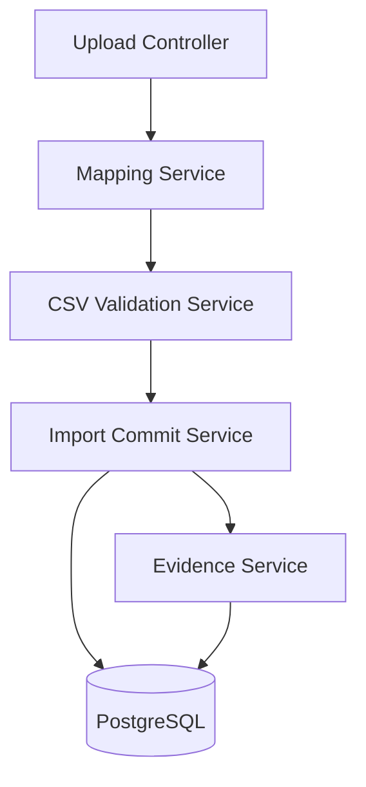
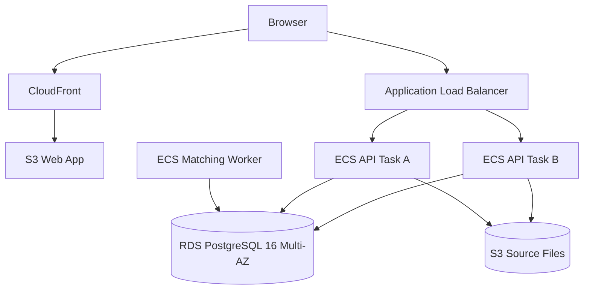
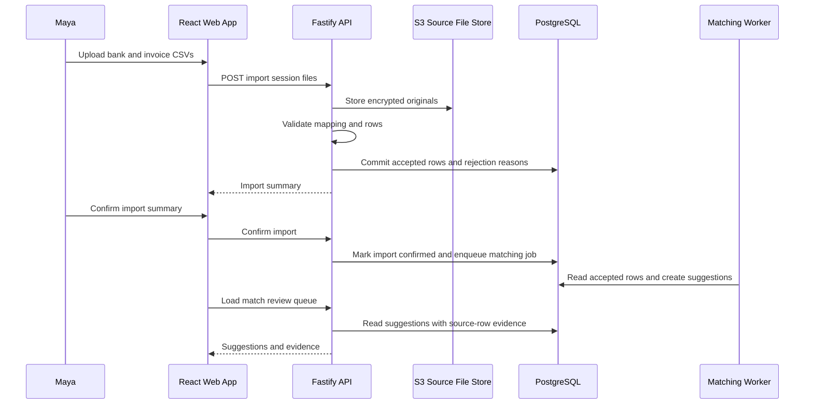

## Purpose

Architecture is the **highest-authority structural artifact** in the Design
activity. Its unique job is to describe the durable system shape: boundaries,
containers, externally visible integrations, deployment topology, critical data
flows, quality attributes, and structural tradeoffs.

For what belongs at this level versus Solution Design and Technical Design, see
the zoom-stack matrix in `workflows/activities/02-design/README.md`.

## Example

<details open>
<summary>Show a worked example of this artifact</summary>

``````markdown
---
ddx:
  id: example.architecture.depositmatch
  authoring:
    home: repo
  depends_on:
    - example.product-vision.depositmatch
    - example.prd.depositmatch
    - example.concerns.depositmatch
    - example.feature-specification.depositmatch.csv-import
---

# Architecture

## Scope

This architecture covers DepositMatch v1: CSV import, match suggestion review,
exception handling, audit evidence, and reconciliation exports for small
bookkeeping firms. It is driven by the PRD goals of reducing weekly
reconciliation time, preserving reviewer trust, and keeping unresolved deposits
owned. Bank feeds, accounting platform sync, payroll, inventory, and tax
workflows are outside the v1 architecture boundary.

## Level 1: System Context

| Element | Type | Purpose | Protocol |
|---------|------|---------|----------|
| Maya, Reconciliation Lead | User | Imports exports, reviews suggestions, resolves exceptions | HTTPS browser |
| Andre, Firm Owner | User | Reviews firm-level reconciliation reports | HTTPS browser |
| DepositMatch | System | Reconciliation workspace and evidence store | HTTPS |
| Bank portal exports | External source | Provides deposit CSV files | Manual CSV export/upload |
| Accounting exports | External source | Provides invoice CSV files | Manual CSV export/upload |



## Level 2: Container Diagram

| Container | Technology | Responsibilities | Communication |
|-----------|------------|------------------|---------------|
| Web App | React 18, TypeScript 5 | Import workflow, mapping review, match review, exception queue, reports | HTTPS JSON to API |
| API Service | Node 20, Fastify 5, TypeScript 5 | Auth boundary, CSV upload orchestration, validation, matching commands, exception commands, exports | HTTPS JSON; SQL to PostgreSQL; S3 SDK |
| Matching Worker | Node 20, TypeScript 5 | Asynchronous match suggestion generation and confidence scoring | PostgreSQL job table; SQL |
| Database | PostgreSQL 16 on Amazon RDS | Clients, imports, source rows, invoices, deposits, matches, exceptions, audit log | TLS SQL |
| Source File Store | Amazon S3 with SSE-KMS | Encrypted uploaded CSV originals for audit and reprocessing | S3 API from API Service |
| Observability | CloudWatch Logs and Metrics | Application logs, import timing, worker failures, backup alarms | AWS agent/API |



## Level 3: Component Diagram

The API Service needs component detail because CSV import, traceability, and
matching are coupled at the boundary.

| Component | Container | Purpose | Notes |
|-----------|-----------|---------|-------|
| Upload Controller | API Service | Receives bank and invoice CSV uploads for one client import session | Rejects non-CSV files before parsing |
| Mapping Service | API Service | Saves and applies per-client column mappings | Never imports rows with unresolved required mappings |
| CSV Validation Service | API Service | Validates amounts, dates, identifiers, duplicates, and required columns | Produces row-level rejection reasons |
| Import Commit Service | API Service | Atomically records accepted source rows and traceability fields | Transaction boundary for import confirmation |
| Evidence Service | API Service | Supplies source-row evidence to match review, exceptions, and exports | Reads normalized fields and source metadata |



## Module Boundaries

**Source Applicability**: source; DepositMatch includes handwritten application code.

| Module | Responsibility / Owned Types | Public API | Allowed Dependencies | Forbidden Dependencies |
|--------|------------------------------|------------|----------------------|------------------------|
| api/domain | Owns matching invariants and core value types | Match decision and validation functions | Pure standard-library utilities | Services, Fastify, SQL, S3 SDK |
| api/application | Import and review orchestration; application-owned requests | Import and review operations; Contracts define shared surfaces | domain and application-owned ports | Fastify, concrete SQL/S3 adapters |
| api/adapters | HTTP, SQL and S3 integration; maps rows, vendor errors and transport DTOs | Implement application ports | domain, application, Fastify, SQL driver, S3 SDK | Other adapters' private implementation |
| api/bootstrap | Construct and connect concrete implementations | start | application and adapters | Domain business rules |

**Integration Owners**: PostgreSQL -> api/adapters/sql; S3 -> api/adapters/storage; Fastify -> api/adapters/http. Each translates representations and errors before calling application APIs.
**Construction Policy**: api/bootstrap is the composition root and supplies concrete adapters to application-owned ports.
**Boundary Check**: npm run check:boundaries (project-local import rules; invoked by pre-commit and CI).

Import cycles are forbidden. Domain state changes use validation functions;
mutable internals are private. Review checks public-type leakage and invariant
protection; the import gate alone cannot prove these semantics. The checker must
pass an allowed application-to-domain import and reject a domain-to-S3 import.

## Deployment

| Component | Infrastructure | Instances | Scaling | Backup / Recovery |
|-----------|----------------|-----------|---------|-------------------|
| Web App | S3 static hosting behind CloudFront, us-east-1 | 1 distribution | CDN-managed | Versioned S3 bucket; redeploy from CI |
| API Service | ECS Fargate service behind Application Load Balancer, us-east-1 | 2 tasks minimum | CPU > 60% for 5 minutes or p95 import latency > 3 seconds | Rolling deploy; previous task definition retained |
| Matching Worker | ECS Fargate service, us-east-1 | 1 task minimum | Job backlog > 100 for 5 minutes | Restart failed task; jobs remain in PostgreSQL |
| Database | Amazon RDS PostgreSQL 16, Multi-AZ | 1 primary, 1 standby | Vertical scaling by planned maintenance | PITR enabled; 15-minute RPO; 4-hour RTO |
| Source File Store | S3 bucket with SSE-KMS and versioning | Regional service | S3-managed | Versioning and lifecycle retention |



## Data Flow



## Quality Attributes

| Attribute | Target | Strategy | Verification |
|-----------|--------|----------|--------------|
| Import performance | Validate and summarize 10,000 total rows in under 5 seconds | Stream parse uploads, validate before commit, keep import commit transactional | Import benchmark in CI with representative CSV fixtures |
| Evidence traceability | 100% of accepted rows used in suggestions expose source file, row number, identifier, amount, and date | Preserve source metadata at import commit and read it through Evidence Service | Story tests for match review evidence and reconciliation export |
| Security | No raw financial row values in analytics or application logs | Structured logging allowlist; encrypted S3 and RDS storage; role-scoped audit access | Log scan tests, infrastructure review, access-control tests |
| Availability | 99.5% monthly availability for pilot firms | Two API tasks, RDS Multi-AZ, static web CDN, worker jobs persisted in DB | CloudWatch uptime and error-rate alarms |
| Disaster Recovery | 15-minute RPO and 4-hour RTO | RDS point-in-time recovery, S3 versioning, retained task definitions | Quarterly restore drill before paid launch |

## Decisions and Tradeoffs

| Decision | Status | Rationale | Follow-up |
|----------|--------|-----------|-----------|
| Use PostgreSQL 16 as the system of record | Accepted inline | Import traceability, matching evidence, exceptions, and audit logs need transactional consistency more than separate specialized stores. | Create ADR before production if another store is introduced. |
| Store uploaded CSV originals in encrypted S3 | Accepted inline | Preserving originals supports audit and reprocessing without bloating PostgreSQL. | Define retention period with firm owners and legal reviewer. |
| Use PostgreSQL-backed worker jobs for v1 | Accepted inline | Pilot volume does not justify a separate queue yet; keeping jobs in PostgreSQL reduces operational surface. | Revisit if matching backlog exceeds 100 jobs for 5 minutes repeatedly. |
| Keep bank feeds and accounting APIs outside v1 | Accepted by PRD non-goals | CSV import is enough to validate reviewer trust and weekly reconciliation speed. | Revisit after pilot CSV success metrics are met. |
``````

</details>

## Reference

<table class="helix-reference-table">
<tbody>
<tr><th>Activity</th><td><a href="../../../reference/glossary/activities/"><strong>Design</strong></a> — Decide how to build it. Capture trade-offs, contracts, and architecture decisions.</td></tr>
<tr><th>Default location</th><td><code>docs/helix/02-design/architecture.md</code></td></tr>
<tr><th>Requires</th><td><em>None</em></td></tr>
<tr><th>Enables</th><td><em>None</em></td></tr>
<tr><th>Informs</th><td><a href="../../../artifact-types/design/solution-design/">Solution Design</a><br><a href="../../../artifact-types/design/technical-design/">Technical Design</a><br><a href="../../../artifact-types/design/adr/">ADR</a><br><a href="../../../artifact-types/design/contract/">Contract</a><br><a href="../../../artifact-types/design/data-design/">Data Design</a><br><a href="../../../artifact-types/design/security-architecture/">Security Architecture</a></td></tr>
<tr><th>Referenced by</th><td><a href="../../../artifact-types/design/solution-design/">Solution Design</a><br><a href="../../../artifact-types/design/technical-design/">Technical Design</a><br><a href="../../../artifact-types/deploy/deployment-checklist/">Deployment Checklist</a><br><a href="../../../artifact-types/deploy/runbook/">Runbook</a><br><a href="../../../artifact-types/deploy/monitoring-setup/">Monitoring Setup</a></td></tr>
<tr><th>HELIX documents</th><td><a href="https://github.com/DocumentDrivenDX/helix/blob/main/docs/helix/02-design/architecture.md"><code>docs/helix/02-design/architecture.md</code></a></td></tr>
<tr><th>Generation prompt</th><td><details><summary>Show the full generation prompt</summary><pre><code># Architecture Documentation Generation Prompt&#10;&#10;Document the architecture views that the team actually needs to build, review,&#10;operate, and evolve the system.&#10;&#10;## Purpose&#10;&#10;Architecture is the **highest-authority structural artifact** in the Design&#10;activity. Its unique job is to describe the durable system shape: boundaries,&#10;containers, externally visible integrations, deployment topology, critical data&#10;flows, quality attributes, and structural tradeoffs.&#10;&#10;For what belongs at this level versus Solution Design and Technical Design, see&#10;the zoom-stack matrix in `workflows/activities/02-design/README.md`.&#10;&#10;## Reference Anchors&#10;&#10;Use these local resource summaries as grounding:&#10;&#10;- `docs/resources/c4-model.md` grounds context, container, component, and&#10;  deployment views as audience-specific structural diagrams.&#10;- `docs/resources/sei-quality-attribute-scenarios.md` grounds measurable&#10;  quality attributes and tradeoff reasoning.&#10;- `docs/resources/microsoft-azure-well-architected-framework.md` grounds&#10;  cross-cutting reliability, security, operations, performance, and cost&#10;  tradeoffs.&#10;&#10;## Focus&#10;- Include only the C4 views that add information; omit empty or duplicate views.&#10;- Keep boundaries, deployment shape, data flow, and quality attributes visible.&#10;- Annotate major tradeoffs or constraints directly on the relevant view or summary.&#10;- Remove generic architecture commentary.&#10;&#10;## Boundary Test&#10;&#10;See the zoom-stack matrix in `workflows/activities/02-design/README.md` for&#10;which decisions belong at the system, feature, and story levels.&#10;&#10;## Completion Criteria&#10;- The views are understandable at a glance.&#10;- Key boundaries and tradeoffs are visible.&#10;- The document stays implementation-relevant.&#10;- Containers name real technologies, not generic roles.&#10;- Quality attributes have measurable targets and verification methods.&#10;- Deployment names actual infrastructure shape, scaling, and backup approach.&#10;- Major decisions link to ADRs or include an inline decision note.&#10;&#10;## Module Boundary Evidence&#10;&#10;For handwritten source, include Module Boundaries using the evidence format in&#10;`workflows/concerns/modularity-and-encapsulation/practices.md`. Name actual&#10;modules, responsibilities and owned types, minimal public APIs, permitted and&#10;forbidden imports, integration owners/translation locations, construction policy,&#10;and a concrete project-local boundary-check command. Classify domain types,&#10;service orchestration, and integration representations separately. Apply the&#10;selected architecture style without imposing inversion on classic-layered.&#10;Source-free projects record applicability and reason; a tiny source project may&#10;use one row. Legacy artifacts remain structurally valid without this section,&#10;but current source feature readiness requires explicit adoption. Validate populated&#10;fields; review semantics and confirm the check command exists before handoff.</code></pre></details></td></tr>
<tr><th>Template</th><td><details><summary>Show the template structure</summary><pre><code>---&#10;ddx:&#10;  id: architecture&#10;  authoring:&#10;    home: repo&#10;---&#10;&#10;# Architecture&#10;&#10;## Scope&#10;&#10;[What system this architecture covers, what is deliberately outside the&#10;architecture boundary, and which PRD/features/user journeys drive the design.]&#10;&#10;## Level 1: System Context&#10;&#10;| Element | Type | Purpose | Protocol |&#10;|---------|------|---------|----------|&#10;| [User/System] | User/External | [Interaction] | [HTTP/API/etc] |&#10;&#10;```mermaid&#10;graph TB&#10;    %% Add users, system, and external dependencies&#10;```&#10;&#10;## Level 2: Container Diagram&#10;&#10;| Container | Technology | Responsibilities | Communication |&#10;|-----------|------------|------------------|---------------|&#10;| [Name] | [Stack] | [What it does] | [Protocol/Format] |&#10;&#10;```mermaid&#10;graph TB&#10;    %% Add containers: Web, API, DB, Queue, Worker, external systems&#10;```&#10;&#10;## Level 3: Component Diagram&#10;&#10;Include only when a container needs internal structure to support downstream&#10;design and review. Omit this section when container responsibilities are enough.&#10;&#10;| Component | Container | Purpose | Notes |&#10;|-----------|-----------|---------|-------|&#10;| [Name] | [Container] | [Responsibility] | [Key decisions] |&#10;&#10;```mermaid&#10;graph TB&#10;    %% Optional: add components inside the container that needs detail&#10;```&#10;&#10;## Module Boundaries&#10;&#10;**Source Applicability**: [source or source-free; reason]&#10;&#10;For source projects, complete every cell. A single module is sufficient for a&#10;small program; do not add layers solely to fill the table. Source-free projects&#10;may omit the table and fields below after recording the reason above.&#10;&#10;| Module | Responsibility / Owned Types | Public API | Allowed Dependencies | Forbidden Dependencies |&#10;|--------|------------------------------|------------|----------------------|------------------------|&#10;| [Package/file] | [Responsibility and owned types] | [Exported names or Contract reference] | [Permitted imports] | [Forbidden imports] |&#10;&#10;**Integration Owners**: [External system -&gt; owning module and translation location, or None; reason]&#10;**Construction Policy**: [Owner/location for wiring or deliberate local construction]&#10;**Boundary Check**: [Concrete project-local command shared by local checks, pre-commit and CI]&#10;&#10;## Deployment&#10;&#10;| Component | Infrastructure | Instances | Scaling | Backup / Recovery |&#10;|-----------|----------------|-----------|---------|-------------------|&#10;| [Name] | [Cloud/service/runtime] | [Count] | [Trigger or limit] | [Backup/failover path] |&#10;&#10;```mermaid&#10;graph TB&#10;    %% Add actual deployment topology&#10;```&#10;&#10;## Data Flow&#10;&#10;```mermaid&#10;sequenceDiagram&#10;    %% Add sequence for the most important user journey or operational flow&#10;```&#10;&#10;## Quality Attributes&#10;&#10;| Attribute | Target | Strategy | Verification |&#10;|-----------|--------|----------|--------------|&#10;| Availability | [Target] | [How architecture supports it] | [How checked] |&#10;| Performance | [Target] | [How architecture supports it] | [How checked] |&#10;| Security | [Target] | [Controls/boundaries] | [How checked] |&#10;| Disaster Recovery | RTO: [target] / RPO: [target] | [Backup/failover strategy] | [How checked] |&#10;&#10;## Decisions and Tradeoffs&#10;&#10;| Decision | Status | Rationale | Follow-up |&#10;|----------|--------|-----------|-----------|&#10;| [ADR-NNN or inline decision] | [Accepted/Proposed] | [Why this shape wins] | [ADR, spike, or none] |</code></pre></details></td></tr>
</tbody>
</table>
