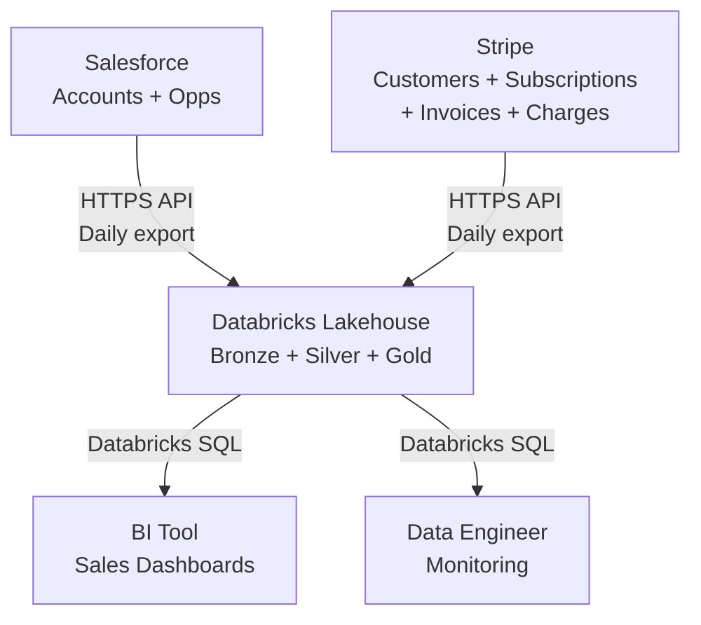

## Purpose

Data Architecture is the **highest-authority structural artifact for data pipeline
design** in the Design activity. Its unique job is to describe the durable pipeline
shape: ingestion patterns, medallion layer topology, streaming vs. batch semantics,
transformation patterns, governance boundaries, quality gates, and critical
performance or cost tradeoffs.

Data Architecture is not a data model (captured in Data Design), implementation plan,
or ADR. It is the bridge between Data PRD (requirements) and implementation: "given
these requirements, here is how the pipeline is structured."

## Example

<details open>
<summary>Show a worked example of this artifact</summary>

``````markdown
---
ddx:
  id: example.data-architecture.customer-360
  depends_on:
    - example.data-prd.customer-360
---

# Data Architecture: Customer-360 Analytics

## Scope

This architecture covers the Customer-360 medallion pipeline: daily batch ingestion
of Salesforce accounts, opportunities, and Stripe customers, subscriptions, invoices,
and charges into a Databricks Lakehouse. It includes Bronze raw-layer storage,
Silver reconciliation and deduplication, and Gold fact/dimension tables for
analytics queries. Historical loads of 12 months are supported; incremental daily
loads begin in week 2. Streaming ingestion, ML training stores, and external data
warehouse federation are outside v1 scope.

## Level 1: System Context

| Element | Type | Purpose | Protocol |
|---------|------|---------|----------|
| Salesforce | External source | Customer accounts, opportunities, ownership | HTTPS REST API; daily full export |
| Stripe | External source | Customers, subscriptions, invoices, charges | HTTPS REST API; daily full export (webhook in v2) |
| Databricks Lakehouse | Data Platform | Medallion storage and compute for ingestion and queries | Databricks SQL; PySpark jobs |
| BI Tool (Tableau/Sigma) | Consumer | Sales and finance dashboards querying Gold tables | Databricks SQL via ODBC |
| Data Engineer | Role | Orchestrates jobs, monitors SLAs, maintains schemas | Databricks workflows, notebooks |



## Level 2: Medallion Architecture

### Bronze Layer (Raw)

Immutable copies of source system exports, organized by system and entity.

| Table | Source | Partitioning | Retention | Notes |
|-------|--------|--------------|-----------|-------|
| bronze.salesforce_accounts | Salesforce API | date_loaded | 90 days | Full daily export; preserves all fields |
| bronze.salesforce_opportunities | Salesforce API | date_loaded | 90 days | Full daily export; includes closed_date |
| bronze.stripe_customers | Stripe API | date_loaded | 90 days | Full daily export; includes metadata tags |
| bronze.stripe_subscriptions | Stripe API | date_loaded | 90 days | Full daily export; includes status changes |
| bronze.stripe_invoices | Stripe API | date_loaded | 90 days | Full daily export; raw line items |
| bronze.stripe_charges | Stripe API | date_loaded | 90 days | Full daily export; includes payment outcomes |

**Quality**: No transformation; SLA violations block Silver load until Bronze is complete.

### Silver Layer (Deduplicated & Reconciled)

Cleaned, deduplicated, and reconciled data with lineage and quality flags.

| Table | Source(s) | Partitioning | Retention | Key Transformations |
|-------|-----------|--------------|-----------|---------------------|
| silver.dim_customer | bronze.salesforce_accounts + bronze.stripe_customers | customer_id | 3 years | 1:1 Salesforce-to-Stripe match via email; hash PII; null-check on account names |
| silver.dim_date | N/A (calendar) | date_key | 5 years | Standard calendar table; fiscal month, quarter, year |
| silver.fct_subscription_event | bronze.stripe_subscriptions | subscription_id, event_date | 3 years | Deduplicate on Stripe subscription ID; flag late-arriving rows; join to dim_customer |
| silver.fct_payment_transaction | bronze.stripe_charges + bronze.stripe_invoices | charge_id, payment_date | 3 years | Flatten invoice line items; join charge to invoice and subscription; hash card brand |
| silver.reconciliation_log | N/A | load_date | 90 days | Count of matched/unmatched pairs per load; reconciliation confidence scores |

**Quality**: PII hashing, null validation, late-arriving fact flags, join lineage recorded.

### Gold Layer (Aggregated Facts)

Business-ready tables for analytics and reporting.

| Table | Business Use | Grain | Partitioning | Retention |
|-------|------------------|-------|--------------|-----------|
| gold.fct_monthly_revenue | Sales forecasting, revenue metrics | 1 row per customer per month | customer_id, year_month | 3 years |
| gold.fct_subscription_health | Churn risk scoring, subscription metrics | 1 row per subscription | subscription_id, as_of_date | 3 years |
| gold.dim_customer_account | Account overview, drill-down | 1 row per customer | customer_id | 3 years |

**Computations**:
- `fct_monthly_revenue`: Sums paid invoices grouped by customer and calendar month; includes subscription state
- `fct_subscription_health`: Latest subscription status, months active, failed payment count, aging of unpaid invoices
- `dim_customer_account`: Joins Salesforce account attributes with current Stripe subscription status

## Level 3: Data Flow

```mermaid
sequenceDiagram
    participant SF as Salesforce API
    participant Stripe as Stripe API
    participant DBX as Databricks
    participant Bronze as Bronze Tables
    participant Silver as Silver Tables
    participant Gold as Gold Tables
    participant BI as BI Tool

    SF->>DBX: Daily export (accounts, opps)
    Stripe->>DBX: Daily export (customers, subs, invoices, charges)
    DBX->>Bronze: Land raw data; validate schema and completeness
    Note over DBX: Reconciliation: match Salesforce-Stripe via email
    Bronze->>Silver: Deduplicate, hash PII, join and flag late arrivals
    Note over Silver: Check reconciliation accuracy (98% threshold)
    Silver->>Gold: Aggregate facts and dimensions
    Gold->>BI: SQL query for dashboards
    Note over BI: Sales forecast, churn alerts, AR aging
```

## Level 4: Deployment and Compute

### Orchestration

| Component | Technology | Schedule | Resource | SLA |
|-----------|----------|----------|----------|-----|
| Salesforce Export Job | Databricks Workflow + PySpark | 10pm UTC daily | 2-worker job cluster, 8 DBU | Complete by 2am UTC |
| Stripe Export Job | Databricks Workflow + PySpark | 10pm UTC daily | 2-worker job cluster, 8 DBU | Complete by 2am UTC |
| Reconciliation + Silver Load | Databricks Workflow + SQL | 3am UTC daily (after Bronze) | 2-worker job cluster, 8 DBU | Complete by 5am UTC |
| Gold Aggregation + Refresh | Databricks Workflow + SQL | 5am UTC daily (after Silver) | 2-worker job cluster, 8 DBU | Complete by 7am UTC |

### Compute Sizing

- **Job Cluster**: 2 workers, 8 DBU/hour per cluster
- **Estimated Monthly Cost**: 4 jobs × 8 DBU × 30 days = 960 DBU ≈ $480 USD
- **Query Workload**: +50 DBU/month for analyst ad-hoc queries (estimate)
- **Total Budget**: ≤ $500 USD/month

### Storage

| Layer | Format | Location | Retention Policy |
|-------|--------|----------|------------------|
| Bronze | Delta | s3://main-catalog/customer_360_bronze/ | Delete after 90 days |
| Silver | Delta | s3://main-catalog/customer_360_silver/ | Delete after 3 years (Delta VACUUM) |
| Gold | Delta | s3://main-catalog/customer_360_gold/ | Delete after 3 years (Delta VACUUM) |

## Quality Attributes

| Attribute | Target | Strategy | Verification |
|-----------|--------|----------|--------------|
| Data Freshness | Gold tables available by 7am UTC daily | Orchestrated daily batch completing 5am; monitor job logs for failures | Scheduled report execution; query execution logs |
| Reconciliation Accuracy | ≥ 98% Salesforce-Stripe matched pairs | Fuzzy email matching in Silver; confidence scoring on match quality | Daily reconciliation_log audit; manual spot-check |
| Lineage Traceability | 100% of Gold rows trace to Bronze source records | Preserve source IDs and load timestamps through all layers | Audit queries joining Gold → Silver → Bronze |
| Cost Containment | ≤ $500 USD/month | Monitor job runtime and query execution time; set alarms on DBU overage | Monthly billing dashboard in Databricks |

## Key Design Decisions

| Decision | Rationale | Tradeoffs |
|----------|-----------|-----------|
| Daily batch, not streaming | Stripe webhook integration costs 2+ weeks; batch fully validates; sales SLA accepts 24-hour latency | Query latency ≤ 24 hours; no real-time churn alerts; easier to replay failed days |
| Separate Bronze/Silver/Silver schemas | Data governance: PII isolation, access control per layer, easy to backfill one layer without reprocessing others | More tables to maintain and document; requires clear naming conventions |
| Salesforce-Stripe match via email + fuzzy | Email is the most reliable cross-system identifier; fuzzy matching handles case and domain normalization | ≠ 100% accuracy; requires manual linking for edge cases; depends on email data quality |
| Flatten Stripe invoice line items in Silver | Simplifies Gold aggregations; avoids multi-row-per-invoice complexity in joins | Denormalizes at Silver (but Silver is allowed to denormalize for analytics) |
| Hash card brand (not full card) in Silver | PCI compliance: no raw card tokens or full numbers stored | Aggregate metrics cannot distinguish card issuer; acceptable for v1 |

## Future Considerations

- **Streaming Subscriptions**: Stripe webhooks in v2 for sub-minute payment latency
- **ML Feature Store**: Separate feature-engineering layer for churn-scoring models
- **Cross-System Orchestration**: Airflow/dbt Cloud for multi-workspace lineage
- **Snowflake Federation**: External tables for cost optimization if query volume scales
``````

</details>

## Reference

<table class="helix-reference-table">
<tbody>
<tr><th>Activity</th><td><a href="/reference/glossary/activities/"><strong>Design</strong></a> — Decide how to build it. Capture trade-offs, contracts, and architecture decisions.</td></tr>
<tr><th>Default location</th><td><code>docs/helix/02-design/data-architecture.md</code></td></tr>
<tr><th>Requires</th><td><em>None</em></td></tr>
<tr><th>Enables</th><td><em>None</em></td></tr>
<tr><th>Informs</th><td><a href="/artifact-types/test/data-quality-expectations/">Data Quality Expectations</a><br><a href="/artifact-types/design/technical-design/">Technical Design</a><br><a href="/artifact-types/design/solution-design/">Solution Design</a></td></tr>
<tr><th>Referenced by</th><td><a href="/artifact-types/test/data-quality-expectations/">Data Quality Expectations</a><br><a href="/artifact-types/build/implementation-plan/">Implementation Plan</a><br><a href="/artifact-types/deploy/runbook/">Runbook</a></td></tr>
<tr><th>Generation prompt</th><td><details><summary>Show the full generation prompt</summary><pre><code># Data Architecture Generation Prompt&#10;&#10;Document the data pipeline architecture that the team needs to build, review,&#10;operate, and evolve the data product.&#10;&#10;## Purpose&#10;&#10;Data Architecture is the **highest-authority structural artifact for data pipeline&#10;design** in the Design activity. Its unique job is to describe the durable pipeline&#10;shape: ingestion patterns, medallion layer topology, streaming vs. batch semantics,&#10;transformation patterns, governance boundaries, quality gates, and critical&#10;performance or cost tradeoffs.&#10;&#10;Data Architecture is not a data model (captured in Data Design), implementation plan,&#10;or ADR. It is the bridge between Data PRD (requirements) and implementation: &quot;given&#10;these requirements, here is how the pipeline is structured.&quot;&#10;&#10;## Reference Anchors&#10;&#10;Use these local resource summaries as grounding:&#10;&#10;- `docs/resources/databricks-lakehouse-medallion-architecture.md` grounds&#10;  medallion topology (Bronze/Silver/Gold layer responsibilities, transformations,&#10;  and quality gates).&#10;- `docs/resources/databricks-auto-loader.md` grounds cloud-native ingestion&#10;  patterns for incremental, scalable, schema-aware source connectors.&#10;- `docs/resources/databricks-streaming-tables.md` grounds declarative streaming&#10;  and materialized views for real-time transformations and quality enforcement.&#10;- `docs/resources/databricks-sdp.md` grounds SDP lineage, governance, and&#10;  quality-first design through `EXPECT ... ON VIOLATION ...` clauses and&#10;  contract-driven pipeline composition.&#10;&#10;## Focus&#10;&#10;- Sketch the medallion layer flow: what lands in Bronze, what transformations&#10;  happen in Silver, what business tables live in Gold.&#10;- Name ingestion patterns (Auto Loader, Streaming Tables, batched SQL, CDC) and&#10;  why each is used for its source.&#10;- Document transformation semantics: idempotence, exactly-once vs. at-least-once,&#10;  stateful operations, and how schema evolution is handled.&#10;- Specify governance and quality checkpoints: where data is validated, which&#10;  layers enforce which contracts, and how SLA compliance is monitored.&#10;- Call out critical performance or cost tradeoffs: partitioning strategy,&#10;  clustering, retention policy, incremental refresh vs. full rebuild.&#10;&#10;## Role Boundary&#10;&#10;Data Architecture describes pipeline topology and data flow, not the detailed&#10;data model (Data Design), not implementation sequences (Implementation Plan),&#10;and not individual quality checks (Data Quality Expectations).&#10;&#10;**Databricks Platform Substitution:** If you are adopting this on another data&#10;platform, substitute as follows:&#10;&#10;| Databricks Concept | Snowflake Equivalent | BigQuery Equivalent | On-Prem / Other |&#10;|---|---|---|---|&#10;| Medallion layers (Bronze/Silver/Gold) | Same pattern applies universally | Same pattern applies universally | Same pattern applies universally |&#10;| Auto Loader | Snowpipe or native connectors | Dataflow, BigQuery Connector Hub | Apache NiFi, Kafka connectors |&#10;| Streaming Tables with `EXPECT` clauses | Stream-triggered materialized views + native checks | Dataflow with Beam assertions | Apache Flink with custom state management |&#10;| Databricks Jobs for orchestration | Snowflake Tasks | Cloud Composer (Airflow) or Cloud Workflows | Apache Airflow, Dagster, dbt Cloud |&#10;| SDP `EXPECT ... ON VIOLATION ...` | Data Quality checks + Task error handling | BigQuery Data Quality API + Cloud Workflows | dbt tests, Great Expectations, custom assertions |&#10;| Delta Lake format | Iceberg or proprietary formats | Native BigQuery tables | Apache Parquet, Iceberg, Hudi |&#10;&#10;## Completion Criteria&#10;&#10;- Medallion layer diagram or description is clear (what lands where, why).&#10;- Each layer&#x27;s transformation responsibilities are explicit.&#10;- Ingestion patterns name actual technologies and explain why each is used.&#10;- Quality gates are named (where validation happens, what contracts are&#10;  enforced).&#10;- Performance/cost tradeoffs are visible (partitioning, clustering, retention,&#10;  refresh strategy).&#10;- Deployment topology is concrete (number of clusters, auto-scaling, failover).&#10;- Major decisions link to Data PRD requirements or include inline rationale.</code></pre></details></td></tr>
<tr><th>Template</th><td><details><summary>Show the template structure</summary><pre><code>---&#10;ddx:&#10;  id: data-architecture&#10;---&#10;&#10;# Data Architecture&#10;&#10;## Overview&#10;&#10;[Describe the data product being architected, the business problem it solves, and the system context. Name the key data flows and Databricks platform fit. Reference the [[data-prd]] for the business requirements and success metrics this architecture must satisfy.]&#10;&#10;### Scope&#10;&#10;[What data flows and systems are covered by this architecture? What is deliberately outside the boundary? Which requirements from [[data-prd]] drive the design decisions?]&#10;&#10;### System Context&#10;&#10;| External System | Role | Protocol | Data Volume |&#10;|-----------------|------|----------|------------|&#10;| [e.g., Salesforce] | [Source system for customer data] | [REST API, batch export] | [M records/day] |&#10;| [e.g., Data Warehouse] | [Consumer of aggregated data] | [Delta API, SQL] | [K rows/hour] |&#10;&#10;```mermaid&#10;graph TB&#10;    A[&quot;Salesforce&lt;br/&gt;(Source)&quot;] --&gt;|REST API&lt;br/&gt;hourly| B[&quot;Databricks&lt;br/&gt;Data Platform&quot;]&#10;    C[&quot;Stripe&lt;br/&gt;(Source)&quot;] --&gt;|S3 batch export| B&#10;    B --&gt;|Consumption Layer| D[&quot;BI Tool&lt;br/&gt;(Looker/Tableau)&quot;]&#10;    B --&gt;|ML Training| E[&quot;ML Platform&quot;]&#10;```&#10;&#10;## Medallion Topology&#10;&#10;### Architecture Pattern&#10;&#10;[Describe the medallion layer strategy: Bronze (raw), Silver (validated), Gold (consumption). For each layer, explain the transformation scope, quality gates, and consumer responsibilities.]&#10;&#10;### Bronze Layer (Raw Ingestion)&#10;&#10;**Purpose**: Land source data in its native form without transformation.&#10;&#10;**Source Integration**:&#10;- Source System: [e.g., Salesforce]&#10;- Integration Pattern: [Auto Loader, Streaming Tables, scheduled batch import]&#10;- Schema Validation: [Applied at ingestion, reject if schema mismatch]&#10;- Retention: [e.g., 7 days rolling window for cost efficiency]&#10;&#10;**Responsibilities**:&#10;- Ingest all records from source&#10;- Preserve source schema exactly (no column renames or type coercion)&#10;- Tag records with `_ingest_timestamp` and source system identifier&#10;- Detect and quarantine records that fail schema validation&#10;&#10;**Quality Gates**:&#10;- All records have `_ingest_timestamp` and source system id&#10;- No truncation of source columns&#10;- Fail fast if source unavailable for &gt;4 hours&#10;&#10;### Silver Layer (Validated and Transformed)&#10;&#10;**Purpose**: Cleansed, deduplicated, and business-logic-ready data.&#10;&#10;**Transformations**:&#10;- Deduplication: [Method: e.g., &quot;keep latest by timestamp&quot;, &quot;PK uniqueness constraint&quot;]&#10;- Data type coercion: [e.g., &quot;convert dates to ISO-8601, currency to numeric&quot;]&#10;- Null handling: [e.g., &quot;fill defaults, or fail if critical column null&quot;]&#10;- Referential integrity: [e.g., &quot;customer_id must exist in customer dimension&quot;]&#10;&#10;**Join Strategy**:&#10;| Join | Left | Right | Type | Cardinality | Latency Impact |&#10;|------|------|-------|------|-------------|---|&#10;| [customer enrichment] | `customer_events` | `customer_master` | [Left Outer] | [1:1] | [Add 100ms] |&#10;&#10;**Retention**: [e.g., 90 days]&#10;&#10;**Responsibilities**:&#10;- Enforce UNIQUE and NOT NULL constraints per data quality expectations&#10;- Materialize aggregations needed for Gold layer&#10;- Document row counts and latency metrics per transformation&#10;&#10;**Quality Gates**:&#10;- Zero duplicates (PK uniqueness)&#10;- ≥99% NOT NULL on critical columns&#10;- Row count reconciliation with source ±0.1%&#10;&#10;### Gold Layer (Consumption)&#10;&#10;**Purpose**: Business-ready tables optimized for consumer queries.&#10;&#10;**Consumption Tables**:&#10;| Table | Use Case | Consumers | Freshness | Aggregation |&#10;|-------|----------|-----------|-----------|------------|&#10;| `customer_360` | Single customer view, 360-degree profile | Analytics, ML | Hourly | None (deduped Silver) |&#10;| `daily_sales_summary` | Daily revenue by product | Finance, BI | Daily | SUM(amount) by product_date |&#10;&#10;**Optimization Strategy**:&#10;- Partitioning: [e.g., &quot;by date for date-range queries&quot;]&#10;- Z-order: [e.g., &quot;on customer_id, product_id for filter selectivity&quot;]&#10;- Caching: [Materialized views for slow queries]&#10;&#10;**Retention**: [e.g., 2 years for compliance and analytics]&#10;&#10;**Responsibilities**:&#10;- Keep Gold current with Silver ingestion cadence&#10;- Publish schema and SLA via UC catalog comments&#10;- Monitor query performance; alert if p95 latency &gt; SLA&#10;&#10;**Quality Gates**:&#10;- Sums reconcile between Silver aggregates and Gold tables ±0.01%&#10;- All customer IDs in Gold exist in Silver Silver&#10;- Latency ≤SLA (e.g., ≤5 seconds for 90th percentile query)&#10;&#10;## Data Flow&#10;&#10;[Describe how data moves through the medallion layers. Clarify ingestion frequency, transformation latency, and refresh strategy.]&#10;&#10;### Ingestion Flow&#10;&#10;```mermaid&#10;graph LR&#10;    A[&quot;Salesforce API&quot;] --&gt;|Auto Loader&lt;br/&gt;every 15 min| B[&quot;Bronze&lt;br/&gt;raw_customers&quot;]&#10;    B --&gt;|PySpark Job&lt;br/&gt;dedup + validate| C[&quot;Silver&lt;br/&gt;customers_validated&quot;]&#10;    C --&gt;|SQL notebook&lt;br/&gt;daily 9am UTC| D[&quot;Gold&lt;br/&gt;customer_360&quot;]&#10;    D --&gt;|Published to UC| E[&quot;Consumers&lt;br/&gt;BI, ML&quot;]&#10;```&#10;&#10;### Incremental vs Full Refresh&#10;&#10;- **Bronze**: [Incremental via change data capture, or full reload?]&#10;- **Silver**: [Incremental updates on specific key columns, or full recalc?]&#10;- **Gold**: [Append-only fact tables, or snapshot updates?]&#10;&#10;## Processing Semantics&#10;&#10;### Streaming vs Batch Decision&#10;&#10;| Layer | Strategy | Rationale | SLA Implication |&#10;|-------|----------|-----------|-----------------|&#10;| Bronze | [Streaming / Batch / Incremental Batch] | [Why this choice?] | [Freshness achieved] |&#10;| Silver | [Streaming / Batch / Incremental Batch] | [Why this choice?] | [Freshness achieved] |&#10;| Gold | [Streaming / Batch / Incremental Batch] | [Why this choice?] | [Freshness achieved] |&#10;&#10;### Processing Framework&#10;&#10;- **Framework**: [Databricks SQL, PySpark, dbt on Databricks, Streaming Tables]&#10;- **Orchestration**: [Databricks Workflows, Airflow, dbt Cloud]&#10;- **Failure Handling**: [Retry policy, dead-letter queue, manual intervention?]&#10;&#10;### Latency and Throughput Targets&#10;&#10;| Stage | Target Latency | Target Throughput | Constraint |&#10;|-------|-----------------|-------------------|-----------|&#10;| Salesforce → Bronze | ≤15 minutes | 1M records/day | API rate limit: 100 req/min |&#10;| Bronze → Silver | ≤30 minutes | 1M records/day | PySpark cluster size |&#10;| Silver → Gold | ≤2 hours | 100K aggregates/day | SQL query complexity |&#10;&#10;## Quality Contracts&#10;&#10;[Define expectations as testable EXPECT clauses per Databricks SDP. Each expectation binds the architecture: data violating it is rejected before reaching consumers.]&#10;&#10;### Bronze Layer Expectations&#10;&#10;```sql&#10;-- Raw data must match source schema exactly&#10;EXPECT TABLE raw_customers (&#10;  customer_id NOT NULL,&#10;  email NOT NULL,&#10;  created_at TIMESTAMP NOT NULL,&#10;  _ingest_timestamp TIMESTAMP NOT NULL GENERATED ALWAYS AS (CURRENT_TIMESTAMP())&#10;);&#10;```&#10;&#10;- **Expectation**: All records ingested within 15 min of source commit&#10;- **Violation**: Alert; do not advance to Silver&#10;- **SLA**: Detect within 5 minutes&#10;&#10;### Silver Layer Expectations&#10;&#10;```sql&#10;-- Customers must be unique per customer_id, deduplicated by latest timestamp&#10;EXPECT TABLE customers_validated (&#10;  customer_id NOT NULL,&#10;  PRIMARY KEY (customer_id),&#10;  UNIQUE (customer_id)&#10;);&#10;&#10;-- Customer email addresses must be normalized and not null&#10;EXPECT TABLE customers_validated (&#10;  email NOT NULL LIKE &#x27;%@%.%&#x27;&#10;);&#10;```&#10;&#10;- **Expectation**: ≥99% NOT NULL on `email` and `phone`&#10;- **Expectation**: Zero duplicate customers (PK uniqueness)&#10;- **Violation**: Quarantine; manual review before advancing to Gold&#10;&#10;### Gold Layer Expectations&#10;&#10;```sql&#10;-- Customer 360 must be current within freshness SLA (1 hour)&#10;EXPECT TABLE customer_360 (&#10;  MAX(_modified_at) &gt;= CURRENT_TIMESTAMP() - INTERVAL 1 HOUR&#10;);&#10;&#10;-- Revenue aggregates must reconcile with Silver within 0.01%&#10;EXPECT TABLE daily_sales_summary&#10;  CHECK (&#10;    SELECT SUM(amount) FROM daily_sales_summary &#10;    IS WITHIN 0.01% OF &#10;    SELECT SUM(amount) FROM customers_validated&#10;  );&#10;```&#10;&#10;- **Expectation**: Customer 360 is no older than 1 hour&#10;- **Expectation**: Daily sales sums reconcile with Silver ±$0.01 per order&#10;- **Violation**: Reject; roll back to prior snapshot; alert on-call&#10;&#10;### Cross-Layer Data Contracts&#10;&#10;| Contract | Assertion | If Violated |&#10;|----------|-----------|------------|&#10;| [Bronze → Silver row count] | [Silver row count ≤ Bronze + 10% for dedup] | [Alert + manual audit] |&#10;| [Silver → Gold cardinality] | [Gold unique customers = Silver unique customers] | [Reject until reconciled] |&#10;| [Foreign key integrity] | [All orders.customer_id exist in customer_360] | [Quarantine order; alert] |&#10;&#10;## Governance and Access Control&#10;&#10;### Identity and Access Management&#10;&#10;| Role | Catalog | Schema | Table | Permissions |&#10;|------|---------|--------|-------|------------|&#10;| Data Engineer | `prod` | `customer_360` | All | READ, MODIFY, EXECUTE |&#10;| Analytics Lead | `prod` | `customer_360` | `customer_360`, `daily_sales_summary` (Gold only) | SELECT |&#10;| Finance Team | `prod` | `customer_360` | `daily_sales_summary` | SELECT (date ≥ 2 years ago) |&#10;&#10;### Data Classification and Retention&#10;&#10;| Table | Classification | Sensitive Columns | Retention | Masked For |&#10;|-------|------------------|------------------|-----------|-----------|&#10;| `raw_customers` | Internal | `ssn`, `credit_card` | 7 days | [Not masked; only admins see] |&#10;| `customers_validated` | Internal | `email`, `phone` | 90 days | [Non-PII audiences mask these] |&#10;| `customer_360` | Internal | `email` | 2 years | [Mask for BI tool] |&#10;&#10;### Fine-Grained Access Control&#10;&#10;- **Row-Level Security**: [Do analytics users see only their region&#x27;s data? Document the policy.]&#10;- **Column-Level Security**: [Which sensitive columns are masked for which roles?]&#10;- **Dynamic Views**: [Use UC masking functions to redact PII per caller role?]&#10;&#10;## Databricks Platform Design&#10;&#10;### Catalog Organization&#10;&#10;```&#10;prod (Catalog)&#10;├── customer_360 (Schema)&#10;│   ├── raw_customers (Bronze table)&#10;│   ├── customers_validated (Silver table)&#10;│   ├── customer_360 (Gold table)&#10;│   └── daily_sales_summary (Gold aggregate)&#10;├── metadata (Schema)&#10;│   ├── pipeline_runs (audit log)&#10;│   └── quality_metrics (expectations results)&#10;```&#10;&#10;### Compute Strategy&#10;&#10;| Workload | Compute Tier | Cluster Size | DBU Budget | Rationale |&#10;|----------|--------------|--------------|------------|-----------|&#10;| Bronze ingestion (streaming) | All-purpose | 4 workers (i3.xlarge) | 8 DBU/hour | Continuous streaming |&#10;| Silver transformation (batch) | Jobs | 8 workers (i3.2xlarge) | 16 DBU/run | Scheduled nightly |&#10;| Gold aggregation (query) | Serverless SQL | N/A | ~5 DBU/query | Ad-hoc BI queries |&#10;&#10;**Cost Optimization**:&#10;- Spot instances for non-critical workloads: 30% savings&#10;- Auto-terminate idle clusters: reduce waste&#10;- Partition pruning and z-order for faster queries: reduce scans&#10;&#10;### Storage Strategy&#10;&#10;| Layer | Format | Compression | Optimization |&#10;|-------|--------|-------------|--------------|&#10;| Bronze | Delta | Snappy | Partitioned by date (rolling 7-day window) |&#10;| Silver | Delta | Snappy | Z-ordered by customer_id, product_id |&#10;| Gold | Delta | Snappy | Partitioned by date; cached for BI queries |&#10;&#10;**Storage Sizing**: ~500 GB Bronze, ~50 GB Silver, ~5 GB Gold (monthly) → ~$25/month at $0.023/GB/month&#10;&#10;### Databricks Features in Use&#10;&#10;| Feature | Use Case | Configuration |&#10;|---------|----------|---------------|&#10;| Auto Loader | Salesforce → Bronze incremental ingestion | Cloud file location: S3, Schema inference enabled |&#10;| Streaming Tables | Bronze → Silver continuous transformation | Trigger: arrival, 30-second max latency |&#10;| Delta Live Tables | End-to-end medallion pipeline orchestration | Refresh: hourly for Bronze/Silver, daily for Gold |&#10;| Unity Catalog | Governance, lineage, fine-grained access | Enable open sharing across teams |&#10;&#10;## Decisions and Tradeoffs&#10;&#10;### Key Architecture Decisions&#10;&#10;| Decision | Choice | Rationale | Alternative Considered | Consequence |&#10;|----------|--------|-----------|------------------------|------------|&#10;| [Medallion layers] | [Bronze/Silver/Gold] | [Standard Databricks pattern for quality gates] | [Flat schema, 2-layer] | [Slower queries if using Bronze directly; quality risk] |&#10;| [Streaming vs Batch for Silver] | [Batch nightly] | [Simplicity, cost] | [Streaming] | [1-2 hour stale window; acceptable for reporting] |&#10;| [Compute tier for Gold queries] | [Serverless SQL] | [Cost &amp; elasticity; no cluster mgmt] | [All-purpose cluster] | [Higher per-query cost; simpler ops] |&#10;&#10;### Performance vs Cost Tradeoffs&#10;&#10;- **Real-time ingestion** (streaming Bronze): Freshness ≤5 min, but 40% higher DBU cost&#10;- **Materialized Gold aggregates**: Faster queries (100ms), but 20% higher storage cost&#10;- **Spot instances for Silver jobs**: 30% cheaper, but risk of interruption (retry handles it)&#10;&#10;### Known Risks and Mitigations&#10;&#10;| Risk | Mitigation |&#10;|------|-----------|&#10;| [Salesforce API rate limit causes ingestion backlog] | [Implement exponential backoff; buffer in queue; alert if &gt;1 hour backlog] |&#10;| [PII in Bronze accessible to all engineers] | [Mask sensitive columns in published views; audit access logs] |&#10;| [Schema drift in source breaks ingestion] | [Schema registry; auto-detect new columns; manual approval before Silver] |&#10;&#10;---&#10;&#10;## Review Checklist&#10;&#10;Use this checklist during review to validate that the data architecture is complete and ready for implementation:&#10;&#10;- [ ] **Scope** clearly states which data flows are included and which are out of bounds&#10;- [ ] **Medallion Topology** defines Bronze, Silver, Gold layer purposes and transformation rules&#10;- [ ] **Data Flow diagrams** (mermaid) show how data moves through layers and to consumers&#10;- [ ] **Processing Semantics** explicitly state streaming vs batch for each layer with latency targets&#10;- [ ] **Quality Contracts** are written as executable EXPECT clauses (SDP, dbt, SQL constraints)&#10;- [ ] **Failure Handling** specifies what happens when an expectation fails (alert, reject, quarantine)&#10;- [ ] **Access Control** model covers identity, row-level, column-level, and sensitive data masking&#10;- [ ] **Databricks Platform Design** names catalog, schema, compute tier, storage strategy, and DBU budget&#10;- [ ] **Decisions and Tradeoffs** document key choices with rationale and alternatives considered&#10;- [ ] **Cross-layer data contracts** are defined (sums reconcile, cardinality stable, no orphans)&#10;- [ ] **SLA per layer** is documented (freshness, latency, availability targets)&#10;- [ ] No `[TBD]`, `[TODO]`, or `[NEEDS CLARIFICATION]` markers remain&#10;- [ ] Architecture aligns with requirements in [[data-prd]] and can satisfy success metrics&#10;- [ ] References link to [[data-quality-expectations]] for detailed EXPECT clauses per layer</code></pre></details></td></tr>
</tbody>
</table>
