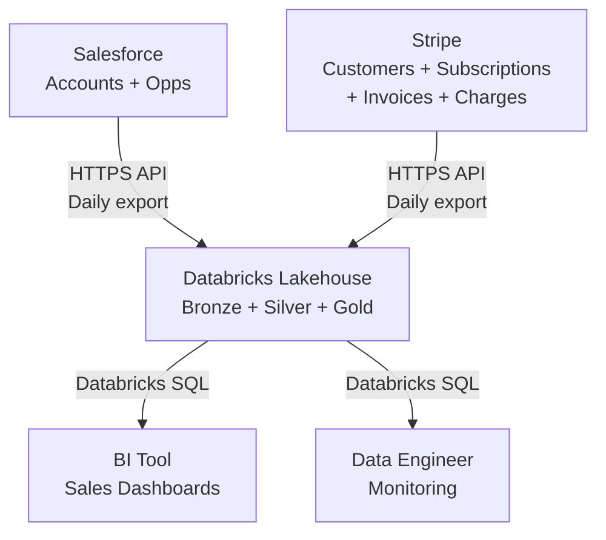

## Purpose

Data Architecture is the **highest-authority structural artifact for data pipeline
design** in the Design activity. Its unique job is to describe the durable pipeline
shape: ingestion patterns, medallion layer topology, streaming vs. batch semantics,
transformation patterns, governance boundaries, quality gates, and critical
performance or cost tradeoffs.

Data Architecture is not a data model (captured in Data Design), implementation plan,
or ADR. It is the bridge between PRD (kind: data) (requirements) and implementation: "given
these requirements, here is how the pipeline is structured."

## Example

<details open>
<summary>Show a worked example of this artifact</summary>

``````markdown
---
ddx:
  id: example.data-architecture.customer-360
  # Previous depends_on: example.data-prd.customer-360 — dropped when
  # data-prd collapsed into prd as kind: data variant (ADR-008). No
  # equivalent example.prd.customer-360 is yet published.
---

# Data Architecture: Customer-360 Analytics

## Scope

This architecture covers the Customer-360 medallion pipeline: daily batch ingestion
of Salesforce accounts, opportunities, and Stripe customers, subscriptions, invoices,
and charges into a Databricks Lakehouse. It includes Bronze raw-layer storage,
Silver reconciliation and deduplication, and Gold fact/dimension tables for
analytics queries. Historical loads of 12 months are supported; incremental daily
loads begin in week 2. Streaming ingestion, ML training stores, and external data
warehouse federation are outside v1 scope.

## Level 1: System Context

| Element | Type | Purpose | Protocol |
|---------|------|---------|----------|
| Salesforce | External source | Customer accounts, opportunities, ownership | HTTPS REST API; daily full export |
| Stripe | External source | Customers, subscriptions, invoices, charges | HTTPS REST API; daily full export (webhook in v2) |
| Databricks Lakehouse | Data Platform | Medallion storage and compute for ingestion and queries | Databricks SQL; PySpark jobs |
| BI Tool (Tableau/Sigma) | Consumer | Sales and finance dashboards querying Gold tables | Databricks SQL via ODBC |
| Data Engineer | Role | Orchestrates jobs, monitors SLAs, maintains schemas | Databricks workflows, notebooks |



## Level 2: Medallion Architecture

### Bronze Layer (Raw)

Immutable copies of source system exports, organized by system and entity.

| Table | Source | Partitioning | Retention | Notes |
|-------|--------|--------------|-----------|-------|
| bronze.salesforce_accounts | Salesforce API | date_loaded | 90 days | Full daily export; preserves all fields |
| bronze.salesforce_opportunities | Salesforce API | date_loaded | 90 days | Full daily export; includes closed_date |
| bronze.stripe_customers | Stripe API | date_loaded | 90 days | Full daily export; includes metadata tags |
| bronze.stripe_subscriptions | Stripe API | date_loaded | 90 days | Full daily export; includes status changes |
| bronze.stripe_invoices | Stripe API | date_loaded | 90 days | Full daily export; raw line items |
| bronze.stripe_charges | Stripe API | date_loaded | 90 days | Full daily export; includes payment outcomes |

**Quality**: No transformation; SLA violations block Silver load until Bronze is complete.

### Silver Layer (Deduplicated & Reconciled)

Cleaned, deduplicated, and reconciled data with lineage and quality flags.

| Table | Source(s) | Partitioning | Retention | Key Transformations |
|-------|-----------|--------------|-----------|---------------------|
| silver.dim_customer | bronze.salesforce_accounts + bronze.stripe_customers | customer_id | 3 years | 1:1 Salesforce-to-Stripe match via email; hash PII; null-check on account names |
| silver.dim_date | N/A (calendar) | date_key | 5 years | Standard calendar table; fiscal month, quarter, year |
| silver.fct_subscription_event | bronze.stripe_subscriptions | subscription_id, event_date | 3 years | Deduplicate on Stripe subscription ID; flag late-arriving rows; join to dim_customer |
| silver.fct_payment_transaction | bronze.stripe_charges + bronze.stripe_invoices | charge_id, payment_date | 3 years | Flatten invoice line items; join charge to invoice and subscription; hash card brand |
| silver.reconciliation_log | N/A | load_date | 90 days | Count of matched/unmatched pairs per load; reconciliation confidence scores |

**Quality**: PII hashing, null validation, late-arriving fact flags, join lineage recorded.

### Gold Layer (Aggregated Facts)

Business-ready tables for analytics and reporting.

| Table | Business Use | Grain | Partitioning | Retention |
|-------|------------------|-------|--------------|-----------|
| gold.fct_monthly_revenue | Sales forecasting, revenue metrics | 1 row per customer per month | customer_id, year_month | 3 years |
| gold.fct_subscription_health | Churn risk scoring, subscription metrics | 1 row per subscription | subscription_id, as_of_date | 3 years |
| gold.dim_customer_account | Account overview, drill-down | 1 row per customer | customer_id | 3 years |

**Computations**:
- `fct_monthly_revenue`: Sums paid invoices grouped by customer and calendar month; includes subscription state
- `fct_subscription_health`: Latest subscription status, months active, failed payment count, aging of unpaid invoices
- `dim_customer_account`: Joins Salesforce account attributes with current Stripe subscription status

## Level 3: Data Flow

```mermaid
sequenceDiagram
    participant SF as Salesforce API
    participant Stripe as Stripe API
    participant DBX as Databricks
    participant Bronze as Bronze Tables
    participant Silver as Silver Tables
    participant Gold as Gold Tables
    participant BI as BI Tool

    SF->>DBX: Daily export (accounts, opps)
    Stripe->>DBX: Daily export (customers, subs, invoices, charges)
    DBX->>Bronze: Land raw data; validate schema and completeness
    Note over DBX: Reconciliation: match Salesforce-Stripe via email
    Bronze->>Silver: Deduplicate, hash PII, join and flag late arrivals
    Note over Silver: Check reconciliation accuracy (98% threshold)
    Silver->>Gold: Aggregate facts and dimensions
    Gold->>BI: SQL query for dashboards
    Note over BI: Sales forecast, churn alerts, AR aging
```

## Level 4: Deployment and Compute

### Orchestration

| Component | Technology | Schedule | Resource | SLA |
|-----------|----------|----------|----------|-----|
| Salesforce Export Job | Databricks Workflow + PySpark | 10pm UTC daily | 2-worker job cluster, 8 DBU | Complete by 2am UTC |
| Stripe Export Job | Databricks Workflow + PySpark | 10pm UTC daily | 2-worker job cluster, 8 DBU | Complete by 2am UTC |
| Reconciliation + Silver Load | Databricks Workflow + SQL | 3am UTC daily (after Bronze) | 2-worker job cluster, 8 DBU | Complete by 5am UTC |
| Gold Aggregation + Refresh | Databricks Workflow + SQL | 5am UTC daily (after Silver) | 2-worker job cluster, 8 DBU | Complete by 7am UTC |

### Compute Sizing

- **Job Cluster**: 2 workers, 8 DBU/hour per cluster
- **Estimated Monthly Cost**: 4 jobs × 8 DBU × 30 days = 960 DBU ≈ $480 USD
- **Query Workload**: +50 DBU/month for analyst ad-hoc queries (estimate)
- **Total Budget**: ≤ $500 USD/month

### Storage

| Layer | Format | Location | Retention Policy |
|-------|--------|----------|------------------|
| Bronze | Delta | s3://main-catalog/customer_360_bronze/ | Delete after 90 days |
| Silver | Delta | s3://main-catalog/customer_360_silver/ | Delete after 3 years (Delta VACUUM) |
| Gold | Delta | s3://main-catalog/customer_360_gold/ | Delete after 3 years (Delta VACUUM) |

## Quality Attributes

| Attribute | Target | Strategy | Verification |
|-----------|--------|----------|--------------|
| Data Freshness | Gold tables available by 7am UTC daily | Orchestrated daily batch completing 5am; monitor job logs for failures | Scheduled report execution; query execution logs |
| Reconciliation Accuracy | ≥ 98% Salesforce-Stripe matched pairs | Fuzzy email matching in Silver; confidence scoring on match quality | Daily reconciliation_log audit; manual spot-check |
| Lineage Traceability | 100% of Gold rows trace to Bronze source records | Preserve source IDs and load timestamps through all layers | Audit queries joining Gold → Silver → Bronze |
| Cost Containment | ≤ $500 USD/month | Monitor job runtime and query execution time; set alarms on DBU overage | Monthly billing dashboard in Databricks |

## Key Design Decisions

| Decision | Rationale | Tradeoffs |
|----------|-----------|-----------|
| Daily batch, not streaming | Stripe webhook integration costs 2+ weeks; batch fully validates; sales SLA accepts 24-hour latency | Query latency ≤ 24 hours; no real-time churn alerts; easier to replay failed days |
| Separate Bronze/Silver/Silver schemas | Data governance: PII isolation, access control per layer, easy to backfill one layer without reprocessing others | More tables to maintain and document; requires clear naming conventions |
| Salesforce-Stripe match via email + fuzzy | Email is the most reliable cross-system identifier; fuzzy matching handles case and domain normalization | ≠ 100% accuracy; requires manual linking for edge cases; depends on email data quality |
| Flatten Stripe invoice line items in Silver | Simplifies Gold aggregations; avoids multi-row-per-invoice complexity in joins | Denormalizes at Silver (but Silver is allowed to denormalize for analytics) |
| Hash card brand (not full card) in Silver | PCI compliance: no raw card tokens or full numbers stored | Aggregate metrics cannot distinguish card issuer; acceptable for v1 |

## Future Considerations

- **Streaming Subscriptions**: Stripe webhooks in v2 for sub-minute payment latency
- **ML Feature Store**: Separate feature-engineering layer for churn-scoring models
- **Cross-System Orchestration**: Airflow/dbt Cloud for multi-workspace lineage
- **Snowflake Federation**: External tables for cost optimization if query volume scales
``````

</details>

## Reference

<table class="helix-reference-table">
<tbody>
<tr><th>Activity</th><td><a href="../../../reference/glossary/activities/"><strong>Design</strong></a> — Decide how to build it. Capture trade-offs, contracts, and architecture decisions.</td></tr>
<tr><th>Default location</th><td><code>docs/helix/02-design/data-architecture.md</code></td></tr>
<tr><th>Requires</th><td><em>None</em></td></tr>
<tr><th>Enables</th><td><em>None</em></td></tr>
<tr><th>Informs</th><td><a href="../../../artifact-types/test/data-quality-expectations/">Data Quality Expectations</a><br><a href="../../../artifact-types/design/technical-design/">Technical Design</a><br><a href="../../../artifact-types/design/solution-design/">Solution Design</a></td></tr>
<tr><th>Referenced by</th><td><a href="../../../artifact-types/test/data-quality-expectations/">Data Quality Expectations</a><br><a href="../../../artifact-types/build/implementation-plan/">Implementation Plan</a><br><a href="../../../artifact-types/deploy/runbook/">Runbook</a></td></tr>
<tr><th>Generation prompt</th><td><details><summary>Show the full generation prompt</summary><pre><code># Data Architecture Generation Prompt&#10;&#10;Document the data pipeline architecture that the team needs to build, review,&#10;operate, and evolve the data product.&#10;&#10;## Purpose&#10;&#10;Data Architecture is the **highest-authority structural artifact for data pipeline&#10;design** in the Design activity. Its unique job is to describe the durable pipeline&#10;shape: ingestion patterns, medallion layer topology, streaming vs. batch semantics,&#10;transformation patterns, governance boundaries, quality gates, and critical&#10;performance or cost tradeoffs.&#10;&#10;Data Architecture is not a data model (captured in Data Design), implementation plan,&#10;or ADR. It is the bridge between PRD (kind: data) (requirements) and implementation: &quot;given&#10;these requirements, here is how the pipeline is structured.&quot;&#10;&#10;## Reference Anchors&#10;&#10;Use these local resource summaries as grounding:&#10;&#10;- `docs/resources/databricks-lakehouse-medallion-architecture.md` grounds&#10;  medallion topology (Bronze/Silver/Gold layer responsibilities, transformations,&#10;  and quality gates).&#10;- `docs/resources/databricks-auto-loader.md` grounds cloud-native ingestion&#10;  patterns for incremental, scalable, schema-aware source connectors.&#10;- `docs/resources/databricks-streaming-tables.md` grounds declarative streaming&#10;  and materialized views for real-time transformations and quality enforcement.&#10;- `docs/resources/databricks-sdp.md` grounds SDP lineage, governance, and&#10;  quality-first design through `EXPECT ... ON VIOLATION ...` clauses and&#10;  contract-driven pipeline composition.&#10;&#10;## Focus&#10;&#10;- Sketch the medallion layer flow: what lands in Bronze, what transformations&#10;  happen in Silver, what business tables live in Gold.&#10;- Name ingestion patterns (Auto Loader, Streaming Tables, batched SQL, CDC) and&#10;  why each is used for its source.&#10;- Document transformation semantics: idempotence, exactly-once vs. at-least-once,&#10;  stateful operations, and how schema evolution is handled.&#10;- Specify governance and quality checkpoints: where data is validated, which&#10;  layers enforce which contracts, and how SLA compliance is monitored.&#10;- Call out critical performance or cost tradeoffs: partitioning strategy,&#10;  clustering, retention policy, incremental refresh vs. full rebuild.&#10;&#10;## Role Boundary&#10;&#10;Data Architecture describes pipeline topology and data flow, not the detailed&#10;data model (Data Design), not implementation sequences (Implementation Plan),&#10;and not individual quality checks (Data Quality Expectations).&#10;&#10;**Non-Databricks platforms:** see&#10;`docs/resources/databricks-platform-substitution.md` for the equivalent&#10;terms on Snowflake, BigQuery, and on-prem stacks. The artifact shape and&#10;prompt stay the same.&#10;&#10;## Completion Criteria&#10;&#10;- Medallion layer diagram or description is clear (what lands where, why).&#10;- Each layer&#x27;s transformation responsibilities are explicit.&#10;- Ingestion patterns name actual technologies and explain why each is used.&#10;- Quality gates are named (where validation happens, what contracts are&#10;  enforced).&#10;- Performance/cost tradeoffs are visible (partitioning, clustering, retention,&#10;  refresh strategy).&#10;- Deployment topology is concrete (number of clusters, auto-scaling, failover).&#10;- Major decisions link to PRD (kind: data) requirements or include inline rationale.</code></pre></details></td></tr>
<tr><th>Template</th><td><details><summary>Show the template structure</summary><pre><code>---&#10;ddx:&#10;  id: data-architecture&#10;---&#10;&#10;# Data Architecture&#10;&#10;Platform- and pipeline-level shape of the data product: medallion topology,&#10;processing-framework choices, governance model, and pipeline-level quality&#10;contracts. Entity-level modelling (logical schema, access patterns,&#10;constraints, migration) lives in [[data-design]].&#10;&#10;## Overview&#10;&#10;[Describe the data product being architected, the business problem it solves,&#10;and the system context. Name the key data flows and platform fit. Reference&#10;[[prd]] (kind: data) for the requirements and success metrics this architecture must&#10;satisfy.]&#10;&#10;### Scope&#10;&#10;[What data flows and systems are covered. What is deliberately out of bounds.&#10;Which requirements from [[prd]] (kind: data) drive the design decisions.]&#10;&#10;### System Context&#10;&#10;| External System | Role | Protocol | Data Volume |&#10;|-----------------|------|----------|------------|&#10;| [Source system] | [Role in the pipeline] | [API, batch export, CDC] | [Order-of-magnitude per period] |&#10;| [Consumer system] | [How it consumes Gold] | [Delta share, SQL, API] | [Query volume] |&#10;&#10;```mermaid&#10;graph TB&#10;    A[&quot;Source A&quot;] --&gt;|ingest| B[&quot;Data Platform&quot;]&#10;    C[&quot;Source B&quot;] --&gt;|ingest| B&#10;    B --&gt;|consumption layer| D[&quot;BI / Reporting&quot;]&#10;    B --&gt;|feature store| E[&quot;ML Platform&quot;]&#10;```&#10;&#10;## Medallion Topology&#10;&#10;### Layer Strategy&#10;&#10;[State the medallion strategy: Bronze (raw), Silver (validated), Gold&#10;(consumption). For each layer, name the transformation scope, quality gates,&#10;and consumer responsibilities. Justify the choice against [[prd]] (kind: data)&#10;freshness and quality requirements.]&#10;&#10;### Bronze Layer (Raw Ingestion)&#10;&#10;- **Purpose**: Land source data in its native form without transformation.&#10;- **Source integration pattern**: [Auto Loader, Streaming Tables, scheduled&#10;  batch import, CDC]&#10;- **Schema handling**: [Strict / inferred / evolution policy]&#10;- **Retention policy**: [Rationale tied to cost and replay needs]&#10;&#10;Responsibilities:&#10;- Ingest all records from source.&#10;- Preserve source schema exactly (no renames or coercion).&#10;- Tag records with ingest timestamp and source-system identifier.&#10;- Quarantine records that fail schema validation.&#10;&#10;Quality gates: ingest-metadata presence, no column truncation, source&#10;availability watchdog.&#10;&#10;### Silver Layer (Validated and Transformed)&#10;&#10;- **Purpose**: Cleansed, deduplicated, business-logic-ready data.&#10;- **Deduplication strategy**: [Key + ordering rule]&#10;- **Type coercion / null policy**: [Defaults vs reject]&#10;- **Referential integrity**: [Which FK relationships are enforced and how]&#10;&#10;Join strategy (pipeline-level — entity-level joins live in [[data-design]]):&#10;&#10;| Join | Source Layers | Type | Cardinality | Latency Impact |&#10;|------|---------------|------|-------------|----------------|&#10;| [Logical join name] | [Left / Right] | [Inner / Outer] | [1:1 / 1:N] | [Qualitative] |&#10;&#10;Quality gates: PK uniqueness, NOT NULL on critical columns, row-count&#10;reconciliation with Bronze within tolerance.&#10;&#10;### Gold Layer (Consumption)&#10;&#10;- **Purpose**: Business-ready tables optimised for consumer queries.&#10;- **Optimisation strategy**: [Partitioning, clustering / z-order, materialised&#10;  views — at the pipeline level, not column-level]&#10;- **Retention policy**: [Compliance and analytics horizon]&#10;&#10;Consumption tables (entity definitions live in [[data-design]]):&#10;&#10;| Table | Use Case | Consumers | Freshness Target |&#10;|-------|----------|-----------|------------------|&#10;| [Gold table name] | [Use case from PRD (kind: data)] | [Persona] | [Target tied to SLA] |&#10;&#10;Quality gates: aggregate reconciliation with Silver, referential integrity&#10;across Gold, latency within consumer SLA.&#10;&#10;## Data Flow&#10;&#10;[Describe how data moves through the medallion layers. Clarify ingestion&#10;frequency, transformation latency, and refresh strategy.]&#10;&#10;```mermaid&#10;graph LR&#10;    A[&quot;Source&quot;] --&gt;|ingest pattern| B[&quot;Bronze&quot;]&#10;    B --&gt;|transform job| C[&quot;Silver&quot;]&#10;    C --&gt;|aggregate job| D[&quot;Gold&quot;]&#10;    D --&gt;|published| E[&quot;Consumers&quot;]&#10;```&#10;&#10;### Incremental vs Full Refresh&#10;&#10;- **Bronze**: [CDC / append / full reload — rationale]&#10;- **Silver**: [Incremental keys / full recalc — rationale]&#10;- **Gold**: [Append-only / snapshot / merge — rationale]&#10;&#10;## Processing Semantics&#10;&#10;### Streaming vs Batch Decision&#10;&#10;| Layer | Strategy | Rationale | SLA Implication |&#10;|-------|----------|-----------|-----------------|&#10;| Bronze | [Streaming / Batch / Incremental] | [Why] | [Freshness achieved] |&#10;| Silver | [Streaming / Batch / Incremental] | [Why] | [Freshness achieved] |&#10;| Gold | [Streaming / Batch / Incremental] | [Why] | [Freshness achieved] |&#10;&#10;### Processing Framework&#10;&#10;- **Framework**: [Databricks SQL, PySpark, dbt, Streaming Tables, Flink, …]&#10;- **Orchestration**: [Workflows, Airflow, dbt Cloud, Dagster, …]&#10;- **Failure handling**: [Retry policy, dead-letter queue, manual intervention]&#10;- **Idempotence / exactly-once posture**: [Per layer]&#10;- **Schema evolution policy**: [Auto-add / manual approval / strict]&#10;&#10;### Latency and Throughput Targets&#10;&#10;| Stage | Latency Target | Throughput Target | Binding Constraint |&#10;|-------|----------------|-------------------|--------------------|&#10;| Source → Bronze | [From PRD (kind: data) SLA] | [Order of magnitude] | [Rate limit, API quota] |&#10;| Bronze → Silver | [From PRD (kind: data) SLA] | [Order of magnitude] | [Compute / dedup cost] |&#10;| Silver → Gold | [From PRD (kind: data) SLA] | [Order of magnitude] | [Query complexity] |&#10;&#10;## Pipeline-Level Quality Contracts&#10;&#10;[Express the contracts the *pipeline* enforces at each layer boundary.&#10;Column-level field rules belong in [[data-quality-expectations]]; this&#10;section names which contracts the architecture commits to enforce and&#10;where.]&#10;&#10;### Bronze → Silver&#10;&#10;- **Schema contract**: [What Silver requires of Bronze]&#10;- **Volume contract**: [Acceptable row-count delta]&#10;- **Freshness contract**: [Max ingest lag before Silver is held]&#10;- **Violation handling**: [Alert / hold / quarantine]&#10;&#10;### Silver → Gold&#10;&#10;- **Uniqueness contract**: [Which keys are unique at Gold]&#10;- **Referential contract**: [Which FK relationships are guaranteed]&#10;- **Aggregate-reconciliation contract**: [Sums and counts must agree within&#10;  tolerance]&#10;- **Violation handling**: [Reject / rollback / alert]&#10;&#10;### Cross-Layer Contracts&#10;&#10;| Contract | Assertion | If Violated |&#10;|----------|-----------|-------------|&#10;| [Row count Bronze → Silver] | [Within tolerance] | [Alert + manual audit] |&#10;| [Cardinality Silver → Gold] | [Stable across refresh] | [Reject until reconciled] |&#10;| [FK integrity across Gold] | [No orphans] | [Quarantine + alert] |&#10;&#10;Detailed `EXPECT` clauses, field-level constraints, and freshness predicates&#10;live in [[data-quality-expectations]].&#10;&#10;## Governance and Access Control&#10;&#10;### Identity and Access Model&#10;&#10;| Role | Catalog Scope | Layer Access | Permissions |&#10;|------|---------------|--------------|-------------|&#10;| [Role from PRD (kind: data) consumers] | [Catalog / schema] | [Bronze / Silver / Gold] | [SELECT / MODIFY / EXECUTE] |&#10;&#10;### Data Classification and Retention&#10;&#10;| Layer | Classification | Sensitive Categories | Retention Policy | Masking Policy |&#10;|-------|----------------|----------------------|------------------|----------------|&#10;| Bronze | [Class] | [Categories — not specific columns; those live in data-design] | [Policy tied to compliance] | [Who sees raw] |&#10;| Silver | [Class] | [Categories] | [Policy] | [Who sees masked vs raw] |&#10;| Gold | [Class] | [Categories] | [Policy] | [Default masking for BI] |&#10;&#10;### Fine-Grained Access Control&#10;&#10;- **Row-level security**: [Tenant / region predicate — policy, not the&#10;  predicate code, which lives in [[data-design]]]&#10;- **Column-level security**: [Which classifications are masked for which&#10;  roles]&#10;- **Dynamic views**: [Masking-function strategy]&#10;&#10;## Platform Design&#10;&#10;### Catalog Organisation&#10;&#10;```&#10;[catalog]&#10;├── [schema]&#10;│   ├── [bronze table family]&#10;│   ├── [silver table family]&#10;│   └── [gold table family]&#10;├── metadata&#10;│   ├── pipeline_runs&#10;│   └── quality_metrics&#10;```&#10;&#10;### Compute Strategy&#10;&#10;| Workload | Compute Tier | Sizing Approach | Rationale |&#10;|----------|--------------|-----------------|-----------|&#10;| Bronze ingestion | [Tier] | [Auto-scale bounds / fixed] | [Continuous vs scheduled] |&#10;| Silver transformation | [Tier] | [Sizing approach] | [Batch vs streaming] |&#10;| Gold consumption | [Tier] | [Sizing approach] | [Query pattern] |&#10;&#10;Cost-shaping levers (qualitative — concrete numbers belong in operational&#10;runbooks, not the architecture):&#10;&#10;- Spot / preemptible instances for retryable workloads.&#10;- Auto-termination of idle clusters.&#10;- Partition pruning and clustering for scan reduction.&#10;- Materialised vs on-demand aggregates.&#10;&#10;### Storage Strategy&#10;&#10;| Layer | Format | Partitioning | Clustering / Optimisation |&#10;|-------|--------|--------------|---------------------------|&#10;| Bronze | [Delta / Iceberg / …] | [By date / source] | [Compaction policy] |&#10;| Silver | [Format] | [By key / date] | [Z-order / cluster keys] |&#10;| Gold | [Format] | [By query predicate] | [Materialised views / cache] |&#10;&#10;### Platform Features in Use&#10;&#10;| Feature | Use Case | Configuration Note |&#10;|---------|----------|--------------------|&#10;| [Auto Loader / equivalent] | [Bronze ingestion] | [Trigger mode, schema mode] |&#10;| [Streaming Tables / equivalent] | [Bronze → Silver] | [Trigger / latency target] |&#10;| [Pipeline orchestrator] | [End-to-end refresh] | [Schedule / dependency] |&#10;| [Governance catalog] | [Access + lineage] | [Cross-team sharing posture] |&#10;&#10;For non-Databricks platforms, see&#10;[`docs/resources/databricks-platform-substitution.md`](../../../../../docs/resources/databricks-platform-substitution.md)&#10;for the platform-equivalent terms.&#10;&#10;## Decisions and Tradeoffs&#10;&#10;### Key Architecture Decisions&#10;&#10;| Decision | Choice | Rationale | Alternative Considered | Consequence |&#10;|----------|--------|-----------|------------------------|-------------|&#10;| [Medallion layering] | [Choice] | [Why] | [Alternative] | [Tradeoff] |&#10;| [Streaming vs batch per layer] | [Choice] | [Why] | [Alternative] | [Tradeoff] |&#10;| [Compute tier per workload] | [Choice] | [Why] | [Alternative] | [Tradeoff] |&#10;&#10;### Performance vs Cost Tradeoffs&#10;&#10;- [Real-time vs near-real-time ingestion — freshness gain vs sustained&#10;  compute cost]&#10;- [Materialised vs on-demand Gold aggregates — query latency vs storage]&#10;- [Spot vs on-demand compute — cost savings vs interruption risk]&#10;&#10;### Known Risks and Mitigations&#10;&#10;| Risk | Mitigation |&#10;|------|------------|&#10;| [Source rate limit causes backlog] | [Backoff + queue buffering + lag alert] |&#10;| [PII exposure in Bronze] | [Masked views + audit logs] |&#10;| [Schema drift from source] | [Schema registry + manual approval gate] |&#10;&#10;---&#10;&#10;## Review Checklist&#10;&#10;- [ ] **Scope** clearly states which data flows are in / out of bounds.&#10;- [ ] **Medallion topology** names Bronze / Silver / Gold purposes and&#10;  transformation rules.&#10;- [ ] **Data flow diagrams** show how data moves through layers and to&#10;  consumers.&#10;- [ ] **Processing semantics** explicitly state streaming vs batch per layer&#10;  with latency targets tied to [[prd]] (kind: data).&#10;- [ ] **Pipeline-level quality contracts** name which contracts each layer&#10;  boundary enforces; detailed `EXPECT` clauses are deferred to&#10;  [[data-quality-expectations]].&#10;- [ ] **Failure handling** specifies what happens when a contract fails&#10;  (alert, reject, quarantine, rollback).&#10;- [ ] **Access control** model covers identity, row-level, column-level,&#10;  and sensitive-data masking at the policy level.&#10;- [ ] **Platform design** names catalog organisation, compute tiering, and&#10;  storage strategy without committing to hardcoded cost numbers.&#10;- [ ] **Decisions and tradeoffs** document key choices with rationale and&#10;  alternatives considered.&#10;- [ ] **Cross-layer contracts** are defined (reconciliation, cardinality,&#10;  no orphans).&#10;- [ ] **SLA per layer** is documented (freshness, latency, availability)&#10;  and traces to [[prd]] (kind: data).&#10;- [ ] No `[TBD]`, `[TODO]`, or `[NEEDS CLARIFICATION]` markers remain.&#10;- [ ] Entity-level details (logical schema, indexes, migrations, store&#10;  selection) are deferred to [[data-design]].&#10;- [ ] For non-Databricks platforms, terms map via&#10;  `docs/resources/databricks-platform-substitution.md`.</code></pre></details></td></tr>
</tbody>
</table>
