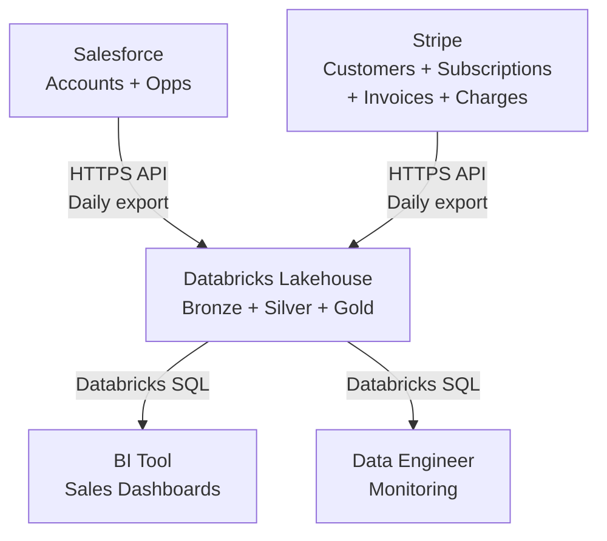

## Purpose

Data Architecture is the **highest-authority structural artifact for data pipeline
design** in the Design activity. Its unique job is to describe the durable pipeline
shape: ingestion patterns, medallion layer topology, streaming vs. batch semantics,
transformation patterns, governance boundaries, quality gates, and critical
performance or cost tradeoffs.

Data Architecture is not a data model (captured in Data Design), implementation plan,
or ADR. It is the bridge between PRD (kind: data) (requirements) and implementation: "given
these requirements, here is how the pipeline is structured."

## Example

<details open>
<summary>Show a worked example of this artifact</summary>

``````markdown
---
ddx:
  id: example.data-architecture.customer-360
  authoring:
    home: repo
  # Previous depends_on: example.data-prd.customer-360 — dropped when
  # data-prd collapsed into prd as kind: data variant (ADR-008). No
  # equivalent example.prd.customer-360 is yet published.
---

# Data Architecture: Customer-360 Analytics

## Overview

Customer-360 joins Salesforce accounts and opportunities with Stripe customers,
subscriptions, invoices, and charges into one Databricks Lakehouse so that sales
and finance can query revenue, subscription health, and account status from a
single set of Gold tables. Today the two systems are reconciled by hand in
spreadsheets; this pipeline replaces that with a daily medallion load whose
reconciliation quality is measured and enforced. Entity-level modelling lives in
[[data-design]]; column-level rules live in [[data-quality-expectations]].

### Scope

This architecture covers the Customer-360 medallion pipeline: daily batch
ingestion of Salesforce accounts and opportunities and Stripe customers,
subscriptions, invoices, and charges into a Databricks Lakehouse. It includes
Bronze raw-layer storage, Silver reconciliation and deduplication, and Gold
fact and dimension tables for analytics queries. Historical loads of 12 months
are supported; incremental daily loads begin in week 2. Streaming ingestion, ML
training stores, and external data warehouse federation are outside v1 scope.
The driving requirements are 24-hour freshness for sales dashboards, a
Salesforce-to-Stripe reconciliation rate of at least 98%, and a compute budget
of at most 500 USD per month.

### System Context

| External System | Role | Protocol | Data Volume |
|-----------------|------|----------|-------------|
| Salesforce | Source of accounts, opportunities, ownership | HTTPS REST API; daily full export | Tens of thousands of accounts; ~5k opportunities per month |
| Stripe | Source of customers, subscriptions, invoices, charges | HTTPS REST API; daily full export (webhook in v2) | ~50k invoices and charges per month |
| Databricks Lakehouse | Medallion storage and compute for ingestion and queries | Databricks SQL; PySpark jobs | Four scheduled jobs per day |
| BI tool (Tableau or Sigma) | Sales and finance dashboards querying Gold | Databricks SQL via ODBC | ~200 dashboard queries per day |
| Data Engineer | Orchestrates jobs, monitors SLAs, maintains schemas | Databricks Workflows, notebooks | Daily monitoring |


```mermaid
graph TB
    SF[Salesforce<br/>Accounts + Opps] -->|HTTPS API<br/>Daily export| DBX[Databricks Lakehouse<br/>Bronze + Silver + Gold]
    Stripe[Stripe<br/>Customers + Subscriptions<br/>+ Invoices + Charges] -->|HTTPS API<br/>Daily export| DBX
    DBX -->|Databricks SQL| BI[BI Tool<br/>Sales Dashboards]
    DBX -->|Databricks SQL| DE[Data Engineer<br/>Monitoring]
```

## Medallion Topology

### Layer Strategy

Three layers, all refreshed by daily batch. Bronze preserves each source export
verbatim so any day can be replayed; Silver reconciles Salesforce to Stripe,
deduplicates, and hashes PII so downstream consumers never see raw identifiers;
Gold serves business-ready facts and dimensions to BI. Daily batch satisfies the
24-hour freshness requirement, and keeping reconciliation in Silver lets the
98% match target be measured once per load rather than per dashboard.

### Bronze Layer (Raw Ingestion)

- **Purpose**: Land each daily export exactly as received, organised by source
  system and entity.
- **Source integration pattern**: Scheduled REST export written to the landing
  path, picked up by Auto Loader in triggered mode once per day.
- **Schema handling**: Strict against the registered source schema; rows with
  unexpected columns are quarantined and a schema change needs manual approval.
- **Retention policy**: 90 days, enough to replay a full quarter of loads while
  keeping raw PII exposure short.

| Table | Source | Partitioning | Retention | Notes |
|-------|--------|--------------|-----------|-------|
| bronze.salesforce_accounts | Salesforce API | date_loaded | 90 days | Full daily export; preserves all fields |
| bronze.salesforce_opportunities | Salesforce API | date_loaded | 90 days | Full daily export; includes closed_date |
| bronze.stripe_customers | Stripe API | date_loaded | 90 days | Full daily export; includes metadata tags |
| bronze.stripe_subscriptions | Stripe API | date_loaded | 90 days | Full daily export; includes status changes |
| bronze.stripe_invoices | Stripe API | date_loaded | 90 days | Full daily export; raw line items |
| bronze.stripe_charges | Stripe API | date_loaded | 90 days | Full daily export; includes payment outcomes |

Responsibilities: ingest every record from the export, preserve source schema
exactly, tag rows with `date_loaded` and source-system identifier, quarantine
rows that fail schema validation.

Quality gates: ingest metadata present on every row, no column truncation,
daily row count at least 95% of the prior day, export watchdog fires if a source
has not landed by 02:00 UTC.

### Silver Layer (Validated and Transformed)

- **Purpose**: Cleaned, deduplicated, reconciled data with lineage and quality
  flags.
- **Deduplication strategy**: Stripe subscription events on
  (`subscription_id`, `event_date`), latest `date_loaded` wins; charges on
  `charge_id`.
- **Type coercion / null policy**: Amounts cast to DECIMAL(18,2); rows with
  null required columns are rejected to quarantine, not defaulted.
- **Referential integrity**: Every payment transaction must resolve to a
  subscription and an invoice; unmatched Salesforce accounts keep a flagged
  `dim_customer` row rather than being dropped.

| Table | Source(s) | Partitioning | Retention | Key Transformations |
|-------|-----------|--------------|-----------|---------------------|
| silver.dim_customer | bronze.salesforce_accounts + bronze.stripe_customers | customer_id | 3 years | 1:1 Salesforce-to-Stripe match via email; hash PII; null-check on account names |
| silver.dim_date | Calendar | date_key | 5 years | Standard calendar table; fiscal month, quarter, year |
| silver.fct_subscription_event | bronze.stripe_subscriptions | subscription_id, event_date | 3 years | Deduplicate on Stripe subscription id; flag late-arriving rows; join to dim_customer |
| silver.fct_payment_transaction | bronze.stripe_charges + bronze.stripe_invoices | charge_id, payment_date | 3 years | Flatten invoice line items; join charge to invoice and subscription; hash card brand |
| silver.reconciliation_log | Derived | load_date | 90 days | Count of matched and unmatched pairs per load; reconciliation confidence scores |

Join strategy (pipeline level; entity-level joins live in [[data-design]]):

| Join | Source Layers | Type | Cardinality | Latency Impact |
|------|---------------|------|-------------|----------------|
| Salesforce account to Stripe customer | Bronze accounts / Bronze customers | Outer, unmatched flagged | 1:1 | Adds ~10 minutes for fuzzy email normalisation |
| Charge to invoice to subscription | Bronze charges / Bronze invoices / Silver subscription events | Inner | N:1 | Low; keyed joins |
| Facts to dim_customer | Silver facts / Silver dim_customer | Inner | N:1 | Low |

Quality gates: PK uniqueness on every Silver table, NOT NULL on critical
columns, reconciliation rate at least 98%, no raw email or phone outside
`dim_customer.email_hash`, row-count reconciliation with Bronze within
tolerance.

### Gold Layer (Consumption)

- **Purpose**: Business-ready tables optimised for dashboard queries.
- **Optimisation strategy**: Partition by `customer_id` and period; Z-order on
  `year_month` and `as_of_date`; no materialised views in v1 because query
  volume is low.
- **Retention policy**: 3 years, matching the finance reporting horizon.

| Table | Use Case | Consumers | Freshness Target |
|-------|----------|-----------|------------------|
| gold.fct_monthly_revenue | Sales forecasting, revenue metrics; 1 row per customer per month | Sales analyst, Finance | Available by 07:00 UTC daily |
| gold.fct_subscription_health | Churn risk scoring, subscription metrics; 1 row per subscription | Sales analyst, Customer success | Available by 07:00 UTC daily |
| gold.dim_customer_account | Account overview and drill-down; 1 row per customer | Sales analyst, BI dashboards | Available by 07:00 UTC daily |

Computations:

- `fct_monthly_revenue`: sums paid invoices grouped by customer and calendar
  month; includes subscription state.
- `fct_subscription_health`: latest subscription status, months active, failed
  payment count, ageing of unpaid invoices.
- `dim_customer_account`: joins Salesforce account attributes with current
  Stripe subscription status.

Quality gates: aggregate revenue reconciles with Silver within 0.01%, customer
cardinality equals Silver, every subscription in Gold exists in Silver, release
by 07:00 UTC.

## Data Flow

Both sources export at 22:00 UTC. Bronze lands by 02:00, Silver reconciliation
finishes by 05:00, and Gold is released to BI by 07:00. Each layer's load is a
separate workflow task gated on the previous layer's quality checks.

```mermaid
sequenceDiagram
    participant SF as Salesforce API
    participant Stripe as Stripe API
    participant DBX as Databricks
    participant Bronze as Bronze Tables
    participant Silver as Silver Tables
    participant Gold as Gold Tables
    participant BI as BI Tool

    SF->>DBX: Daily export (accounts, opps)
    Stripe->>DBX: Daily export (customers, subs, invoices, charges)
    DBX->>Bronze: Land raw data; validate schema and completeness
    Note over DBX: Reconciliation: match Salesforce-Stripe via email
    Bronze->>Silver: Deduplicate, hash PII, join and flag late arrivals
    Note over Silver: Check reconciliation accuracy (98% threshold)
    Silver->>Gold: Aggregate facts and dimensions
    Gold->>BI: SQL query for dashboards
    Note over BI: Sales forecast, churn alerts, AR aging
```

### Incremental vs Full Refresh

- **Bronze**: Full daily export appended as a new `date_loaded` partition; a
  failed day is replayed by overwriting that partition.
- **Silver**: `dim_customer` is fully recomputed each day from the latest Bronze
  partition because matching depends on the whole population; fact tables are
  MERGEd on their natural keys so late-arriving rows update in place.
- **Gold**: The current month is rebuilt from Silver each day; closed months
  are append-only and recomputed only on an explicit backfill.

## Processing Semantics

### Streaming vs Batch Decision

| Layer | Strategy | Rationale | SLA Implication |
|-------|----------|-----------|-----------------|
| Bronze | Batch (daily, triggered Auto Loader) | Both sources offer a daily full export; Stripe webhooks would add two weeks of integration work for no v1 consumer need | Bronze complete by 02:00 UTC |
| Silver | Batch (daily) | Reconciliation needs the full day's population; per-row streaming would recompute matches repeatedly | Silver complete by 05:00 UTC |
| Gold | Batch (daily) | Dashboards are reviewed in the morning; sub-day freshness is not a requirement | Gold released by 07:00 UTC |

### Processing Framework

- **Framework**: PySpark on job clusters for Bronze ingestion; Databricks SQL
  for Silver and Gold transformations.
- **Orchestration**: One Databricks Workflow with four dependent tasks
  (Salesforce export, Stripe export, Silver load, Gold load).
- **Failure handling**: Each task retries once after five minutes; a second
  failure holds all downstream tasks and pages the on-call data engineer.
- **Idempotence / exactly-once posture**: Bronze overwrites its `date_loaded`
  partition; Silver facts MERGE on natural keys; Gold overwrites the affected
  month. Any task can be rerun for a given day without duplicating rows.
- **Schema evolution policy**: Strict. New source columns land in quarantine
  until a data engineer approves the schema change and updates Silver.

### Latency and Throughput Targets

| Stage | Latency Target | Throughput Target | Binding Constraint |
|-------|----------------|-------------------|--------------------|
| Source → Bronze | Complete by 02:00 UTC (4 h after export) | Full export, tens of thousands of rows per source per day | Salesforce and Stripe API rate limits on the export job |
| Bronze → Silver | Complete by 05:00 UTC (3 h) | Full recompute of dim_customer; incremental facts | Fuzzy email matching cost |
| Silver → Gold | Complete by 07:00 UTC (2 h) | Rebuild current month; append closed months | Monthly aggregation over 3 years of facts |

## Pipeline-Level Quality Contracts

The pipeline enforces the following contracts at each layer boundary. The
executable `EXPECT` clauses and SQL assertions (BE-, SE-, GE-, and CL-series)
live in [[data-quality-expectations]].

### Bronze → Silver

- **Schema contract**: Every Bronze table matches its registered source schema;
  Silver refuses to start on a schema mismatch.
- **Volume contract**: Today's row count is at least 95% of the prior day's for
  every Bronze table.
- **Freshness contract**: All six Bronze tables have landed for today's
  `date_loaded` by 02:00 UTC; otherwise Silver is held.
- **Violation handling**: Hold Silver, page on-call, quarantine the partition.

### Silver → Gold

- **Uniqueness contract**: `customer_id` unique in `dim_customer`;
  (`subscription_id`, `event_date`) unique in `fct_subscription_event`;
  `charge_id` unique in `fct_payment_transaction`.
- **Referential contract**: Every payment transaction resolves to a subscription
  and an invoice; every fact row resolves to a `dim_customer` row.
- **Aggregate-reconciliation contract**: Monthly revenue summed in Gold equals
  paid transaction amounts summed in Silver within 0.01%.
- **Violation handling**: Reject the Gold refresh, keep yesterday's Gold live,
  alert on-call and Finance for revenue mismatches.

### Cross-Layer Contracts

| Contract | Assertion | If Violated |
|----------|-----------|-------------|
| Reconciliation rate Bronze → Silver | At least 98% of Salesforce accounts matched to a Stripe customer | Block Gold; investigate matching logic |
| Customer cardinality Silver → Gold | `dim_customer_account` row count equals `dim_customer` row count | Reject Gold until reconciled |
| Subscription lineage Gold → Silver | No `subscription_id` in Gold without a Silver subscription event | Quarantine the Gold rows and alert |
| PII containment | No raw email or phone outside `dim_customer.email_hash` in Silver or Gold | Halt pipeline; compliance review |

## Governance and Access Control

### Identity and Access Model

| Role | Catalog Scope | Layer Access | Permissions |
|------|---------------|--------------|-------------|
| Data engineer | `main.customer_360_*` | Bronze, Silver, Gold | SELECT, MODIFY, EXECUTE on workflows |
| Sales and finance analyst | `main.customer_360_gold` | Gold | SELECT |
| BI service principal | `main.customer_360_gold` | Gold | SELECT via dynamic views |
| Compliance reviewer | `main.customer_360_silver` | Silver (masked) | SELECT on masked views |

### Data Classification and Retention

| Layer | Classification | Sensitive Categories | Retention Policy | Masking Policy |
|-------|----------------|----------------------|------------------|----------------|
| Bronze | Restricted | Customer contact details, billing identifiers, card brand | 90 days then deleted | Raw; data engineers only |
| Silver | Confidential | Hashed contact identifiers, hashed card brand | 3 years (VACUUM after retention) | Hash only; compliance sees masked views |
| Gold | Internal | Aggregated revenue and subscription state per customer | 3 years | Default masking of account owner email for BI |

### Fine-Grained Access Control

- **Row-level security**: None in v1; the workspace serves a single company and
  all analysts may see all customers.
- **Column-level security**: Contact and billing identifiers are hashed in
  Silver; no raw PII exists beyond Bronze, and Bronze is limited to data
  engineers.
- **Dynamic views**: BI reads Gold through dynamic views that mask the account
  owner email unless the caller is in the sales-ops group.

## Platform Design

### Catalog Organisation

```
main
├── customer_360_bronze
│   ├── salesforce_accounts, salesforce_opportunities
│   └── stripe_customers, stripe_subscriptions, stripe_invoices, stripe_charges
├── customer_360_silver
│   ├── dim_customer, dim_date
│   └── fct_subscription_event, fct_payment_transaction, reconciliation_log
├── customer_360_gold
│   ├── fct_monthly_revenue, fct_subscription_health
│   └── dim_customer_account, data_quality_log, data_quality_dashboard
└── customer_360_quarantine
    └── rejected rows by date_loaded
```

### Compute Strategy

| Workload | Compute Tier | Sizing Approach | Rationale |
|----------|--------------|-----------------|-----------|
| Bronze ingestion (two export jobs) | Job cluster, 2 workers | Fixed size; runs once per day | Export volume is predictable; no auto-scaling needed |
| Silver transformation | Job cluster, 2 workers | Fixed size | Reconciliation is bounded by the daily population |
| Gold consumption | Serverless SQL warehouse, small | Auto-stop after 10 minutes idle | Morning dashboard bursts; idle most of the day |

Cost-shaping levers: fixed job clusters with auto-termination, serverless
warehouse auto-stop, partition pruning on `date_loaded` and `year_month`, and
no materialised views until query volume justifies them. The PRD budget
ceiling is 500 USD per month; the current estimate is roughly 960 DBU per
month for jobs plus a small ad-hoc query allowance, tracked in the monthly
billing dashboard.

### Storage Strategy

| Layer | Format | Partitioning | Clustering / Optimisation |
|-------|--------|--------------|---------------------------|
| Bronze | Delta at `s3://main-catalog/customer_360_bronze/` | date_loaded | Weekly OPTIMIZE; VACUUM after 90 days |
| Silver | Delta at `s3://main-catalog/customer_360_silver/` | customer_id, event or payment date | Z-order on customer_id; VACUUM after 3 years |
| Gold | Delta at `s3://main-catalog/customer_360_gold/` | customer_id, year_month or as_of_date | Z-order on year_month; VACUUM after 3 years |

### Platform Features in Use

| Feature | Use Case | Configuration Note |
|---------|----------|--------------------|
| Auto Loader | Bronze ingestion from the export landing path | Triggered once per day; schema mode strict with quarantine |
| Databricks SQL streaming tables with EXPECT | Silver row-level quality checks | Daily trigger; ON VIOLATION DROP ROW to quarantine |
| Databricks Workflows | End-to-end refresh | Four tasks with dependencies; one retry; page on second failure |
| Unity Catalog | Access control, lineage, masking | Dynamic views for BI; audit logs enabled on all three schemas |

For non-Databricks platforms, see
`docs/resources/databricks-platform-substitution.md` for the equivalent terms.

## Decisions and Tradeoffs

### Key Architecture Decisions

| Decision | Choice | Rationale | Alternative Considered | Consequence |
|----------|--------|-----------|------------------------|-------------|
| Ingestion cadence | Daily batch | Both sources offer daily full exports; sales SLA accepts 24-hour latency; batch loads validate fully and replay cleanly | Stripe webhooks streaming into Bronze | No real-time churn alerts in v1; easier replay of failed days |
| Layer isolation | Separate Bronze, Silver, Gold schemas | PII isolation, per-layer access control, backfill one layer without reprocessing others | Single schema with layer prefixes | More tables to document; needs naming discipline |
| Customer matching | Email match with fuzzy normalisation in Silver | Email is the most reliable cross-system identifier | Manual mapping table maintained by sales ops | Not 100% accurate; unmatched accounts flagged for manual linking |
| Invoice line items | Flatten into Silver payment transactions | Simplifies Gold aggregations; avoids multi-row-per-invoice joins | Keep line items normalised until Gold | Denormalised Silver, acceptable for analytics use |
| Card data | Hash card brand only; never store card tokens | PCI scope stays out of the lakehouse | Store tokenised card references | Metrics cannot distinguish issuer; acceptable for v1 |

### Performance vs Cost Tradeoffs

- Daily batch instead of streaming trades sub-day freshness for roughly half
  the compute cost and a far simpler replay story.
- Rebuilding the current Gold month each day trades a few minutes of compute
  for exact aggregates without incremental-merge edge cases.
- A serverless SQL warehouse for BI trades slightly higher per-query cost for
  zero idle cost outside the morning dashboard window.
- Fixed job clusters trade elasticity for predictable spend inside the
  500 USD monthly ceiling.

### Known Risks and Mitigations

| Risk | Mitigation |
|------|------------|
| Salesforce or Stripe export fails or is late | Export watchdog at 02:00 UTC; one retry; page on-call; Silver held rather than run on a partial day |
| Reconciliation rate drops below 98% after a CRM data change | SE-001 blocks Gold; reconciliation_log confidence scores highlight the affected segment |
| PII exposure in Bronze | Bronze restricted to data engineers; 90-day retention; audit logs enabled |
| Schema drift from a source | Strict schema mode quarantines new columns; manual approval gate before Silver changes |
| Monthly cost exceeds budget as volume grows | DBU alarm on the billing dashboard; move Gold to incremental merge before adding compute |

### Future Considerations

- Stripe webhooks feeding a streaming Bronze path for sub-minute payment
  latency (v2).
- A separate feature-engineering layer for churn-scoring models.
- Cross-workspace orchestration and lineage if a second data product shares
  the Silver customer dimension.
- External tables or Delta Sharing if query volume from other warehouses grows.
``````

</details>

## Reference

<table class="helix-reference-table">
<tbody>
<tr><th>Activity</th><td><a href="../../../reference/glossary/activities/"><strong>Design</strong></a> — Decide how to build it. Capture trade-offs, contracts, and architecture decisions.</td></tr>
<tr><th>Default location</th><td><code>docs/helix/02-design/data-architecture.md</code></td></tr>
<tr><th>Requires</th><td><em>None</em></td></tr>
<tr><th>Enables</th><td><em>None</em></td></tr>
<tr><th>Informs</th><td><a href="../../../artifact-types/test/data-quality-expectations/">Data Quality Expectations</a><br><a href="../../../artifact-types/design/technical-design/">Technical Design</a><br><a href="../../../artifact-types/design/solution-design/">Solution Design</a></td></tr>
<tr><th>Referenced by</th><td><a href="../../../artifact-types/test/data-quality-expectations/">Data Quality Expectations</a><br><a href="../../../artifact-types/build/implementation-plan/">Implementation Plan</a><br><a href="../../../artifact-types/deploy/runbook/">Runbook</a></td></tr>
<tr><th>Generation prompt</th><td><details><summary>Show the full generation prompt</summary><pre><code># Data Architecture Generation Prompt&#10;&#10;Document the data pipeline architecture that the team needs to build, review,&#10;operate, and evolve the data product.&#10;&#10;## Purpose&#10;&#10;Data Architecture is the **highest-authority structural artifact for data pipeline&#10;design** in the Design activity. Its unique job is to describe the durable pipeline&#10;shape: ingestion patterns, medallion layer topology, streaming vs. batch semantics,&#10;transformation patterns, governance boundaries, quality gates, and critical&#10;performance or cost tradeoffs.&#10;&#10;Data Architecture is not a data model (captured in Data Design), implementation plan,&#10;or ADR. It is the bridge between PRD (kind: data) (requirements) and implementation: &quot;given&#10;these requirements, here is how the pipeline is structured.&quot;&#10;&#10;## Reference Anchors&#10;&#10;Use these local resource summaries as grounding:&#10;&#10;- `docs/resources/databricks-lakehouse-medallion-architecture.md` grounds&#10;  medallion topology (Bronze/Silver/Gold layer responsibilities, transformations,&#10;  and quality gates).&#10;- `docs/resources/databricks-auto-loader.md` grounds cloud-native ingestion&#10;  patterns for incremental, scalable, schema-aware source connectors.&#10;- `docs/resources/databricks-streaming-tables.md` grounds declarative streaming&#10;  and materialized views for real-time transformations and quality enforcement.&#10;- `docs/resources/databricks-sdp.md` grounds SDP lineage, governance, and&#10;  quality-first design through `EXPECT ... ON VIOLATION ...` clauses and&#10;  contract-driven pipeline composition.&#10;&#10;## Focus&#10;&#10;- Sketch the medallion layer flow: what lands in Bronze, what transformations&#10;  happen in Silver, what business tables live in Gold.&#10;- Name ingestion patterns (Auto Loader, Streaming Tables, batched SQL, CDC) and&#10;  why each is used for its source.&#10;- Document transformation semantics: idempotence, exactly-once vs. at-least-once,&#10;  stateful operations, and how schema evolution is handled.&#10;- Specify governance and quality checkpoints: where data is validated, which&#10;  layers enforce which contracts, and how SLA compliance is monitored.&#10;- Call out critical performance or cost tradeoffs: partitioning strategy,&#10;  clustering, retention policy, incremental refresh vs. full rebuild.&#10;&#10;## Role Boundary&#10;&#10;Data Architecture describes pipeline topology and data flow, not the detailed&#10;data model (Data Design), not implementation sequences (Implementation Plan),&#10;and not individual quality checks (Data Quality Expectations).&#10;&#10;**Non-Databricks platforms:** see&#10;`docs/resources/databricks-platform-substitution.md` for the equivalent&#10;terms on Snowflake, BigQuery, and on-prem stacks. The artifact shape and&#10;prompt stay the same.&#10;&#10;## Completion Criteria&#10;&#10;- Medallion layer diagram or description is clear (what lands where, why).&#10;- Each layer&#x27;s transformation responsibilities are explicit.&#10;- Ingestion patterns name actual technologies and explain why each is used.&#10;- Quality gates are named (where validation happens, what contracts are&#10;  enforced).&#10;- Performance/cost tradeoffs are visible (partitioning, clustering, retention,&#10;  refresh strategy).&#10;- Deployment topology is concrete (number of clusters, auto-scaling, failover).&#10;- Major decisions link to PRD (kind: data) requirements or include inline rationale.</code></pre></details></td></tr>
<tr><th>Template</th><td><details><summary>Show the template structure</summary><pre><code>---&#10;ddx:&#10;  id: data-architecture&#10;  authoring:&#10;    home: repo&#10;---&#10;&#10;# Data Architecture&#10;&#10;Platform- and pipeline-level shape of the data product: medallion topology,&#10;processing-framework choices, governance model, and pipeline-level quality&#10;contracts. Entity-level modelling (logical schema, access patterns,&#10;constraints, migration) lives in [[data-design]].&#10;&#10;## Overview&#10;&#10;[Describe the data product being architected, the business problem it solves,&#10;and the system context. Name the key data flows and platform fit. Reference&#10;[[prd]] (kind: data) for the requirements and success metrics this architecture must&#10;satisfy.]&#10;&#10;### Scope&#10;&#10;[What data flows and systems are covered. What is deliberately out of bounds.&#10;Which requirements from [[prd]] (kind: data) drive the design decisions.]&#10;&#10;### System Context&#10;&#10;| External System | Role | Protocol | Data Volume |&#10;|-----------------|------|----------|------------|&#10;| [Source system] | [Role in the pipeline] | [API, batch export, CDC] | [Order-of-magnitude per period] |&#10;| [Consumer system] | [How it consumes Gold] | [Delta share, SQL, API] | [Query volume] |&#10;&#10;```mermaid&#10;graph TB&#10;    A[&quot;Source A&quot;] --&gt;|ingest| B[&quot;Data Platform&quot;]&#10;    C[&quot;Source B&quot;] --&gt;|ingest| B&#10;    B --&gt;|consumption layer| D[&quot;BI / Reporting&quot;]&#10;    B --&gt;|feature store| E[&quot;ML Platform&quot;]&#10;```&#10;&#10;## Medallion Topology&#10;&#10;### Layer Strategy&#10;&#10;[State the medallion strategy: Bronze (raw), Silver (validated), Gold&#10;(consumption). For each layer, name the transformation scope, quality gates,&#10;and consumer responsibilities. Justify the choice against [[prd]] (kind: data)&#10;freshness and quality requirements.]&#10;&#10;### Bronze Layer (Raw Ingestion)&#10;&#10;- **Purpose**: Land source data in its native form without transformation.&#10;- **Source integration pattern**: [Auto Loader, Streaming Tables, scheduled&#10;  batch import, CDC]&#10;- **Schema handling**: [Strict / inferred / evolution policy]&#10;- **Retention policy**: [Rationale tied to cost and replay needs]&#10;&#10;Responsibilities:&#10;- Ingest all records from source.&#10;- Preserve source schema exactly (no renames or coercion).&#10;- Tag records with ingest timestamp and source-system identifier.&#10;- Quarantine records that fail schema validation.&#10;&#10;Quality gates: ingest-metadata presence, no column truncation, source&#10;availability watchdog.&#10;&#10;### Silver Layer (Validated and Transformed)&#10;&#10;- **Purpose**: Cleansed, deduplicated, business-logic-ready data.&#10;- **Deduplication strategy**: [Key + ordering rule]&#10;- **Type coercion / null policy**: [Defaults vs reject]&#10;- **Referential integrity**: [Which FK relationships are enforced and how]&#10;&#10;Join strategy (pipeline-level — entity-level joins live in [[data-design]]):&#10;&#10;| Join | Source Layers | Type | Cardinality | Latency Impact |&#10;|------|---------------|------|-------------|----------------|&#10;| [Logical join name] | [Left / Right] | [Inner / Outer] | [1:1 / 1:N] | [Qualitative] |&#10;&#10;Quality gates: PK uniqueness, NOT NULL on critical columns, row-count&#10;reconciliation with Bronze within tolerance.&#10;&#10;### Gold Layer (Consumption)&#10;&#10;- **Purpose**: Business-ready tables optimised for consumer queries.&#10;- **Optimisation strategy**: [Partitioning, clustering / z-order, materialised&#10;  views — at the pipeline level, not column-level]&#10;- **Retention policy**: [Compliance and analytics horizon]&#10;&#10;Consumption tables (entity definitions live in [[data-design]]):&#10;&#10;| Table | Use Case | Consumers | Freshness Target |&#10;|-------|----------|-----------|------------------|&#10;| [Gold table name] | [Use case from PRD (kind: data)] | [Persona] | [Target tied to SLA] |&#10;&#10;Quality gates: aggregate reconciliation with Silver, referential integrity&#10;across Gold, latency within consumer SLA.&#10;&#10;## Data Flow&#10;&#10;[Describe how data moves through the medallion layers. Clarify ingestion&#10;frequency, transformation latency, and refresh strategy.]&#10;&#10;```mermaid&#10;graph LR&#10;    A[&quot;Source&quot;] --&gt;|ingest pattern| B[&quot;Bronze&quot;]&#10;    B --&gt;|transform job| C[&quot;Silver&quot;]&#10;    C --&gt;|aggregate job| D[&quot;Gold&quot;]&#10;    D --&gt;|published| E[&quot;Consumers&quot;]&#10;```&#10;&#10;### Incremental vs Full Refresh&#10;&#10;- **Bronze**: [CDC / append / full reload — rationale]&#10;- **Silver**: [Incremental keys / full recalc — rationale]&#10;- **Gold**: [Append-only / snapshot / merge — rationale]&#10;&#10;## Processing Semantics&#10;&#10;### Streaming vs Batch Decision&#10;&#10;| Layer | Strategy | Rationale | SLA Implication |&#10;|-------|----------|-----------|-----------------|&#10;| Bronze | [Streaming / Batch / Incremental] | [Why] | [Freshness achieved] |&#10;| Silver | [Streaming / Batch / Incremental] | [Why] | [Freshness achieved] |&#10;| Gold | [Streaming / Batch / Incremental] | [Why] | [Freshness achieved] |&#10;&#10;### Processing Framework&#10;&#10;- **Framework**: [Databricks SQL, PySpark, dbt, Streaming Tables, Flink, …]&#10;- **Orchestration**: [Workflows, Airflow, dbt Cloud, Dagster, …]&#10;- **Failure handling**: [Retry policy, dead-letter queue, manual intervention]&#10;- **Idempotence / exactly-once posture**: [Per layer]&#10;- **Schema evolution policy**: [Auto-add / manual approval / strict]&#10;&#10;### Latency and Throughput Targets&#10;&#10;| Stage | Latency Target | Throughput Target | Binding Constraint |&#10;|-------|----------------|-------------------|--------------------|&#10;| Source → Bronze | [From PRD (kind: data) SLA] | [Order of magnitude] | [Rate limit, API quota] |&#10;| Bronze → Silver | [From PRD (kind: data) SLA] | [Order of magnitude] | [Compute / dedup cost] |&#10;| Silver → Gold | [From PRD (kind: data) SLA] | [Order of magnitude] | [Query complexity] |&#10;&#10;## Pipeline-Level Quality Contracts&#10;&#10;[Express the contracts the *pipeline* enforces at each layer boundary.&#10;Column-level field rules belong in [[data-quality-expectations]]; this&#10;section names which contracts the architecture commits to enforce and&#10;where.]&#10;&#10;### Bronze → Silver&#10;&#10;- **Schema contract**: [What Silver requires of Bronze]&#10;- **Volume contract**: [Acceptable row-count delta]&#10;- **Freshness contract**: [Max ingest lag before Silver is held]&#10;- **Violation handling**: [Alert / hold / quarantine]&#10;&#10;### Silver → Gold&#10;&#10;- **Uniqueness contract**: [Which keys are unique at Gold]&#10;- **Referential contract**: [Which FK relationships are guaranteed]&#10;- **Aggregate-reconciliation contract**: [Sums and counts must agree within&#10;  tolerance]&#10;- **Violation handling**: [Reject / rollback / alert]&#10;&#10;### Cross-Layer Contracts&#10;&#10;| Contract | Assertion | If Violated |&#10;|----------|-----------|-------------|&#10;| [Row count Bronze → Silver] | [Within tolerance] | [Alert + manual audit] |&#10;| [Cardinality Silver → Gold] | [Stable across refresh] | [Reject until reconciled] |&#10;| [FK integrity across Gold] | [No orphans] | [Quarantine + alert] |&#10;&#10;Detailed `EXPECT` clauses, field-level constraints, and freshness predicates&#10;live in [[data-quality-expectations]].&#10;&#10;## Governance and Access Control&#10;&#10;### Identity and Access Model&#10;&#10;| Role | Catalog Scope | Layer Access | Permissions |&#10;|------|---------------|--------------|-------------|&#10;| [Role from PRD (kind: data) consumers] | [Catalog / schema] | [Bronze / Silver / Gold] | [SELECT / MODIFY / EXECUTE] |&#10;&#10;### Data Classification and Retention&#10;&#10;| Layer | Classification | Sensitive Categories | Retention Policy | Masking Policy |&#10;|-------|----------------|----------------------|------------------|----------------|&#10;| Bronze | [Class] | [Categories — not specific columns; those live in data-design] | [Policy tied to compliance] | [Who sees raw] |&#10;| Silver | [Class] | [Categories] | [Policy] | [Who sees masked vs raw] |&#10;| Gold | [Class] | [Categories] | [Policy] | [Default masking for BI] |&#10;&#10;### Fine-Grained Access Control&#10;&#10;- **Row-level security**: [Tenant / region predicate — policy, not the&#10;  predicate code, which lives in [[data-design]]]&#10;- **Column-level security**: [Which classifications are masked for which&#10;  roles]&#10;- **Dynamic views**: [Masking-function strategy]&#10;&#10;## Platform Design&#10;&#10;### Catalog Organisation&#10;&#10;```&#10;[catalog]&#10;├── [schema]&#10;│   ├── [bronze table family]&#10;│   ├── [silver table family]&#10;│   └── [gold table family]&#10;├── metadata&#10;│   ├── pipeline_runs&#10;│   └── quality_metrics&#10;```&#10;&#10;### Compute Strategy&#10;&#10;| Workload | Compute Tier | Sizing Approach | Rationale |&#10;|----------|--------------|-----------------|-----------|&#10;| Bronze ingestion | [Tier] | [Auto-scale bounds / fixed] | [Continuous vs scheduled] |&#10;| Silver transformation | [Tier] | [Sizing approach] | [Batch vs streaming] |&#10;| Gold consumption | [Tier] | [Sizing approach] | [Query pattern] |&#10;&#10;Cost-shaping levers (qualitative — concrete numbers belong in operational&#10;runbooks, not the architecture):&#10;&#10;- Spot / preemptible instances for retryable workloads.&#10;- Auto-termination of idle clusters.&#10;- Partition pruning and clustering for scan reduction.&#10;- Materialised vs on-demand aggregates.&#10;&#10;### Storage Strategy&#10;&#10;| Layer | Format | Partitioning | Clustering / Optimisation |&#10;|-------|--------|--------------|---------------------------|&#10;| Bronze | [Delta / Iceberg / …] | [By date / source] | [Compaction policy] |&#10;| Silver | [Format] | [By key / date] | [Z-order / cluster keys] |&#10;| Gold | [Format] | [By query predicate] | [Materialised views / cache] |&#10;&#10;### Platform Features in Use&#10;&#10;| Feature | Use Case | Configuration Note |&#10;|---------|----------|--------------------|&#10;| [Auto Loader / equivalent] | [Bronze ingestion] | [Trigger mode, schema mode] |&#10;| [Streaming Tables / equivalent] | [Bronze → Silver] | [Trigger / latency target] |&#10;| [Pipeline orchestrator] | [End-to-end refresh] | [Schedule / dependency] |&#10;| [Governance catalog] | [Access + lineage] | [Cross-team sharing posture] |&#10;&#10;For non-Databricks platforms, see&#10;[`docs/resources/databricks-platform-substitution.md`](../../../../../docs/resources/databricks-platform-substitution.md)&#10;for the platform-equivalent terms.&#10;&#10;## Decisions and Tradeoffs&#10;&#10;### Key Architecture Decisions&#10;&#10;| Decision | Choice | Rationale | Alternative Considered | Consequence |&#10;|----------|--------|-----------|------------------------|-------------|&#10;| [Medallion layering] | [Choice] | [Why] | [Alternative] | [Tradeoff] |&#10;| [Streaming vs batch per layer] | [Choice] | [Why] | [Alternative] | [Tradeoff] |&#10;| [Compute tier per workload] | [Choice] | [Why] | [Alternative] | [Tradeoff] |&#10;&#10;### Performance vs Cost Tradeoffs&#10;&#10;- [Real-time vs near-real-time ingestion — freshness gain vs sustained&#10;  compute cost]&#10;- [Materialised vs on-demand Gold aggregates — query latency vs storage]&#10;- [Spot vs on-demand compute — cost savings vs interruption risk]&#10;&#10;### Known Risks and Mitigations&#10;&#10;| Risk | Mitigation |&#10;|------|------------|&#10;| [Source rate limit causes backlog] | [Backoff + queue buffering + lag alert] |&#10;| [PII exposure in Bronze] | [Masked views + audit logs] |&#10;| [Schema drift from source] | [Schema registry + manual approval gate] |&#10;&#10;---&#10;&#10;## Review Checklist&#10;&#10;- [ ] **Scope** clearly states which data flows are in / out of bounds.&#10;- [ ] **Medallion topology** names Bronze / Silver / Gold purposes and&#10;  transformation rules.&#10;- [ ] **Data flow diagrams** show how data moves through layers and to&#10;  consumers.&#10;- [ ] **Processing semantics** explicitly state streaming vs batch per layer&#10;  with latency targets tied to [[prd]] (kind: data).&#10;- [ ] **Pipeline-level quality contracts** name which contracts each layer&#10;  boundary enforces; detailed `EXPECT` clauses are deferred to&#10;  [[data-quality-expectations]].&#10;- [ ] **Failure handling** specifies what happens when a contract fails&#10;  (alert, reject, quarantine, rollback).&#10;- [ ] **Access control** model covers identity, row-level, column-level,&#10;  and sensitive-data masking at the policy level.&#10;- [ ] **Platform design** names catalog organisation, compute tiering, and&#10;  storage strategy without committing to hardcoded cost numbers.&#10;- [ ] **Decisions and tradeoffs** document key choices with rationale and&#10;  alternatives considered.&#10;- [ ] **Cross-layer contracts** are defined (reconciliation, cardinality,&#10;  no orphans).&#10;- [ ] **SLA per layer** is documented (freshness, latency, availability)&#10;  and traces to [[prd]] (kind: data).&#10;- [ ] No `[TBD]`, `[TODO]`, or `[NEEDS CLARIFICATION]` markers remain.&#10;- [ ] Entity-level details (logical schema, indexes, migrations, store&#10;  selection) are deferred to [[data-design]].&#10;- [ ] For non-Databricks platforms, terms map via&#10;  `docs/resources/databricks-platform-substitution.md`.</code></pre></details></td></tr>
</tbody>
</table>
