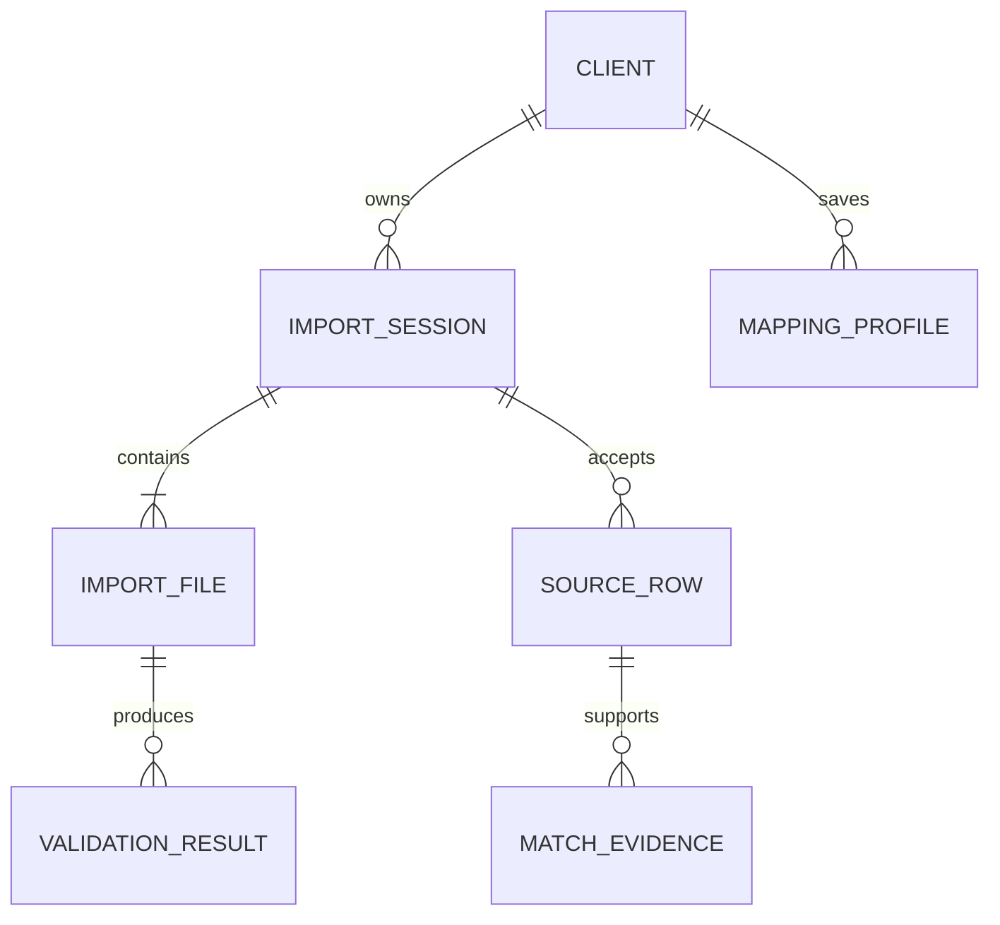
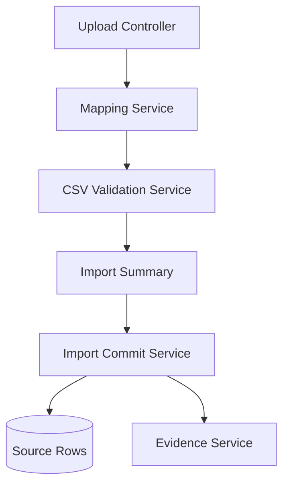

## Purpose

Solution Design is the **feature-level design artifact**. Its unique job is to
translate a Feature Specification into a selected technical approach, domain
model, component decomposition, interface usage, and requirement-to-design
traceability.

It applies Architecture, ADRs, Contracts, and Concerns to one feature or
cross-component capability. For what belongs at this level versus Architecture
and Technical Design, see the zoom-stack matrix in
`workflows/activities/02-design/README.md`.

## Example

<details open>
<summary>Show a worked example of this artifact</summary>

``````markdown
---
ddx:
  id: example.solution-design.depositmatch.csv-import
  depends_on:
    - example.feature-specification.depositmatch.csv-import
    - example.architecture.depositmatch
    - example.adr.depositmatch.postgresql-system-of-record
    - example.contract.depositmatch.import-session-api
  review:
    self_hash: 4d5a2bf5c6b05affdcf7ecc35497aae9f7bb64007e45b62f2a87b42a6914aa00
    deps:
      example.adr.depositmatch.postgresql-system-of-record: d068dcadcfb1b7b4cfa6842e63e078f711128e78d5c2dd7e1666506a7c59d9ad
      example.architecture.depositmatch: 64b7297158175ff16812e401fe093f7624b5ba70b11265a7a4bdf324e50a6bff
      example.contract.depositmatch.import-session-api: 0f6f77f7dca5d1d05590440459fe958f9620857ed3968839e537655dce27cd04
      example.feature-specification.depositmatch.csv-import: d85530eb091209cf9989c9cac3bc1f1063358a5b79964ca0e5e7a384fa77c44a
    reviewed_at: "2026-05-15T04:11:24Z"
---

# Solution Design

**Feature**: FEAT-001 - CSV Import and Column Mapping | **Artifact**:
`docs/helix/02-design/solution-designs/SD-001-csv-import-column-mapping.md`

## Scope

- Feature-level design for creating draft import sessions, uploading CSV files,
  mapping columns, validating rows, summarizing import results, and preserving
  traceability fields.
- Uses the DepositMatch Architecture, ADR-001 PostgreSQL system-of-record
  decision, API-001 import-session contract, and active concerns
  `csv-import-integrity`, `financial-data-security`, and
  `reviewer-auditability`.
- Does not design match suggestion scoring or accounting platform integrations.
- Story-level upload, mapping, and validation implementation details belong in
  TD-001, TD-002, and TD-003.

## Requirements Mapping

### Functional Requirements

| Requirement | Technical Capability | Component | Priority |
|-------------|----------------------|-----------|----------|
| UP-01 accept bank and invoice CSV files | Multipart upload endpoint creates a draft import session and stores encrypted originals | Upload Controller, Source File Store | P0 |
| UP-02 reject non-CSV files | File-type guard before parsing or storage | Upload Controller | P0 |
| MAP-01 require amount/date/identifier mappings | Mapping schema with required semantic fields per source type | Mapping Service | P0 |
| MAP-02 save confirmed mappings for reuse | Per-client mapping profiles keyed by source type | Mapping Service, PostgreSQL | P0 |
| VAL-01 reject missing required mapped columns | Header validation before row import | CSV Validation Service | P0 |
| VAL-02 reject invalid rows | Row validator for amount, date, and duplicate source identifiers | CSV Validation Service | P0 |
| SUM-01 show import summary | Import summary read model from validation results | Import Commit Service, API Service | P0 |
| TRC-01 preserve source metadata | Source row table stores file, row number, identifier, normalized amount/date | Import Commit Service, PostgreSQL | P0 |

### NFR Impact on Architecture

| NFR | Requirement | Architectural Impact | Design Decision |
|-----|-------------|----------------------|-----------------|
| Performance | 10,000 rows summarized in under 5 seconds | Validation must stream parse and batch database writes | Parse in API process, commit accepted rows in one transaction after summary confirmation |
| Security | No raw financial rows in analytics/logs | Logging must use event metadata only | Structured logging allowlist; raw rows only in encrypted S3/PostgreSQL |
| Reliability | Import confirmation atomic | Partial accepted-row commits are not allowed | Transaction boundary in Import Commit Service |

## Solution Approaches

### Approach 1: Parse and validate synchronously in the API

**Description**: The API parses uploaded CSV files, validates mappings and rows,
stores results, and returns an import summary.
**Pros**: Simple user feedback, fewer moving parts, easy pilot operation.
**Cons**: API task must handle peak import CPU and memory.
**Evaluation**: Selected for v1 because pilot imports are bounded at 10,000
rows and the feature needs immediate reviewer feedback.

### Approach 2: Store files and validate asynchronously in the worker

**Description**: The API stores files and enqueues validation work for the
Matching Worker.
**Pros**: Keeps upload endpoint fast and isolates parsing load.
**Cons**: Adds polling or notifications before mapping review; complicates
error recovery for a P0 workflow.
**Evaluation**: Rejected for v1. Revisit if import files exceed 10,000 rows or
validation regularly exceeds 5 seconds.

**Selected Approach**: Synchronous API validation with transactional commit
after reviewer confirmation.

**Architecture/ADR impact**: No change. This design applies the current
Architecture and ADR-001.

## Domain Model



### Business Rules

1. **Required source pair**: A draft import session is not ready for mapping
   until it has one bank CSV and one invoice CSV.
2. **Mapping before import**: Accepted rows cannot be committed until required
   mappings exist for amount, date, and source identifier.
3. **Validation before matching**: Match suggestions cannot be created until the
   reviewer confirms an import summary.
4. **Traceability preservation**: Every accepted row must retain file identity,
   row number, source identifier, normalized amount, and normalized date.

## System Decomposition

### Component: Upload Controller

- **Purpose**: Receive CSV files and create draft import sessions.
- **Responsibilities**: Authenticate and authorize the client, enforce file
  type and size rules, store encrypted originals, return API-001 responses.
- **Requirements Addressed**: UP-01, UP-02.
- **Interfaces**: HTTP API `POST /v1/clients/{clientId}/import-sessions`; S3
  SDK; PostgreSQL.
- **Owned by TDs**: TD-001 upload endpoint and UI integration.

### Component: Mapping Service

- **Purpose**: Manage source-specific column mappings.
- **Responsibilities**: Load saved mappings, validate required semantic fields,
  save confirmed mappings by client and source type.
- **Requirements Addressed**: MAP-01, MAP-02, MAP-03.
- **Interfaces**: API Service internal module; PostgreSQL mapping tables.
- **Owned by TDs**: TD-002 mapping review workflow.

### Component: CSV Validation Service

- **Purpose**: Validate headers and rows before import confirmation.
- **Responsibilities**: Detect missing mapped columns, invalid amounts, invalid
  dates, duplicate source identifiers, and row-level rejection reasons.
- **Requirements Addressed**: VAL-01, VAL-02, VAL-03.
- **Interfaces**: API Service internal module; parsed CSV stream.
- **Owned by TDs**: TD-003 validation rules and test fixtures.

### Component: Import Commit Service

- **Purpose**: Commit accepted rows and import summary atomically.
- **Responsibilities**: Persist accepted source rows, rejection reasons,
  summary counts, and traceability fields.
- **Requirements Addressed**: SUM-01, SUM-02, TRC-01, TRC-02.
- **Interfaces**: PostgreSQL transaction; Evidence Service read model.
- **Owned by TDs**: TD-004 confirmation and source-row persistence.

### Component Interactions



## Technology Rationale

Only feature-specific choices are listed here. System-wide choices remain in
Architecture and ADR-001.

| Layer | Choice | Why | Alternatives Rejected |
|-------|--------|-----|----------------------|
| CSV parser | Papa Parse | Already named in PRD technical context; supports browser and Node parsing patterns | Custom parser rejected because CSV edge cases are easy to mishandle |
| Validation model | Semantic field mapping per source type | Lets client-specific CSV headers map to stable DepositMatch concepts | Hard-coded column names rejected because pilot exports vary |
| Job trigger | PostgreSQL import confirmation state | Keeps matching jobs consistent with accepted rows | Separate queue rejected by ADR-001 for v1 simplicity |

## Traceability

| Requirement ID | Component | Design Element | Test Strategy |
|----------------|-----------|----------------|---------------|
| UP-01 | Upload Controller | Multipart import-session creation | API contract tests for API-001 and US-001 story tests |
| UP-02 | Upload Controller | File-type guard | API negative test with PDF upload |
| MAP-01 | Mapping Service | Required semantic mapping validation | Mapping unit tests with missing amount/date/identifier |
| VAL-02 | CSV Validation Service | Row-level amount/date/duplicate checks | Fixture-based validation tests |
| SUM-02 | Import Commit Service | Matching not enqueued before summary confirmation | Integration test around import status transition |
| TRC-02 | Evidence Service | Source-row evidence projection | Story test for match evidence display |

### Gaps

- [ ] Retention period for uploaded CSV originals needs legal/owner decision.
  Mitigation: keep retention configurable and create an ADR before paid launch.

## Concern Alignment

- **Concerns used**: `csv-import-integrity`, `financial-data-security`,
  `reviewer-auditability`, `a11y-wcag-aa`.
- **Constraints honored**: Required mapping and validation protect CSV
  integrity; raw financial rows stay out of analytics/logs; evidence fields are
  preserved for audit.
- **ADRs referenced**: ADR-001 PostgreSQL as system of record.
- **Departures**: None.

## Constraints & Assumptions

- **Constraints**: v1 supports CSV import only; no bank feed or accounting API
  sync.
- **Assumptions**: Pilot firm files fit within the 10 MB per-file limit and
  10,000-row validation target.
- **Dependencies**: API-001 import-session contract; encrypted S3 storage;
  PostgreSQL 16.

## Risks

| Risk | Prob | Impact | Mitigation |
|------|------|--------|------------|
| CSV layouts vary more than expected | H | M | Keep mappings semantic and per-client; collect pilot fixtures before launch. |
| Synchronous validation exceeds 5 seconds | M | M | Benchmark fixtures in CI; move validation to worker only if target fails repeatedly. |
| Reviewers distrust rejected-row explanations | M | H | Include row number, field, and plain-language reason for every rejection. |
``````

</details>

## Reference

<table class="helix-reference-table">
<tbody>
<tr><th>Activity</th><td><a href="../../../reference/glossary/activities/"><strong>Design</strong></a> — Decide how to build it. Capture trade-offs, contracts, and architecture decisions.</td></tr>
<tr><th>Default location</th><td><code>docs/helix/02-design/solution-designs/SD-{id}-{name}.md</code></td></tr>
<tr><th>Requires</th><td><em>None</em></td></tr>
<tr><th>Enables</th><td><em>None</em></td></tr>
<tr><th>Informs</th><td><a href="../../../artifact-types/design/technical-design/">Technical Design</a><br><a href="../../../artifact-types/test/test-plan/">Test Plan</a></td></tr>
<tr><th>HELIX documents</th><td><a href="https://github.com/DocumentDrivenDX/helix/blob/main/docs/helix/02-design/solution-designs/SD-002-first-class-principles.md"><code>docs/helix/02-design/solution-designs/SD-002-first-class-principles.md</code></a></td></tr>
<tr><th>Generation prompt</th><td><details><summary>Show the full generation prompt</summary><pre><code># Solution Design Generation Prompt&#10;&#10;Create a solution design that maps requirements to a concrete approach.&#10;&#10;## Purpose&#10;&#10;Solution Design is the **feature-level design artifact**. Its unique job is to&#10;translate a Feature Specification into a selected technical approach, domain&#10;model, component decomposition, interface usage, and requirement-to-design&#10;traceability.&#10;&#10;It applies Architecture, ADRs, Contracts, and Concerns to one feature or&#10;cross-component capability. For what belongs at this level versus Architecture&#10;and Technical Design, see the zoom-stack matrix in&#10;`workflows/activities/02-design/README.md`.&#10;&#10;## Reference Anchors&#10;&#10;Use these local resource summaries as grounding:&#10;&#10;- `docs/resources/arc42-solution-strategy.md` grounds feature-level approach,&#10;  decomposition, interfaces, and concise design rationale.&#10;- `docs/resources/c4-model.md` grounds component and interaction views that&#10;  support feature-level decomposition.&#10;&#10;## Focus&#10;- Create a feature-level artifact named `docs/helix/02-design/solution-designs/SD-XXX-[name].md`.&#10;- Show the main options and why the chosen one wins.&#10;- Keep the domain model, decomposition, and tradeoffs concise.&#10;- Cover cross-component system behavior and feature-level structure.&#10;- Name interface usage or needed interface work at feature level, but keep exact&#10;  API, CLI, event, schema, config, telemetry, and adapter surface in Contract&#10;  artifacts. If the solution needs exact fields, commands, payloads, or error&#10;  semantics, link to or request a Contract.&#10;- Preserve only the decisions needed by build and test.&#10;- Stay within the feature scope defined in the zoom-stack matrix&#10;  (`workflows/activities/02-design/README.md`); update the governing artifact&#10;  first if the feature forces a change at a higher level.&#10;&#10;## Boundary Test&#10;&#10;See the zoom-stack matrix in `workflows/activities/02-design/README.md` for&#10;which decisions belong at the system, feature, and story levels.&#10;&#10;## Completion Criteria&#10;- Requirements are mapped.&#10;- Tradeoffs are explicit.&#10;- The chosen approach is clear.&#10;- The output is clearly feature-level and disambiguated from a technical&#10;  design.&#10;- Every P0 requirement has a corresponding design element and test strategy.</code></pre></details></td></tr>
<tr><th>Template</th><td><details><summary>Show the template structure</summary><pre><code>---&#10;ddx:&#10;  id: SD-XXX&#10;  review:&#10;    self_hash: ea6f092342409cc3f74e945b3ae421392eb4787113b828331c0fdfab359bf86d&#10;    deps:&#10;      FEAT-XXX: a685da86c4c18a509196cb163f264af507cc966f804db574070e108a555bdf02&#10;    reviewed_at: &quot;2026-05-15T04:11:24Z&quot;&#10;---&#10;&#10;# Solution Design&#10;&#10;**Feature**: [[FEAT-XXX]] | **Artifact**: `docs/helix/02-design/solution-designs/SD-XXX-[name].md`&#10;&#10;## Scope&#10;&#10;- Feature-level design artifact&#10;- Use for cross-component behavior, main alternatives, domain model, and&#10;  decomposition&#10;- Do not use for one-story implementation details; those belong in `TD-XXX`&#10;- Governing artifacts: [Architecture, ADRs, Contracts, Concerns]&#10;&#10;## Requirements Mapping&#10;&#10;### Functional Requirements&#10;&#10;| Requirement | Technical Capability | Component | Priority |&#10;|------------|---------------------|-----------|----------|&#10;| [Business requirement] | [Technical implementation] | [Component] | P0/P1/P2 |&#10;&#10;### NFR Impact on Architecture&#10;&#10;| NFR | Requirement | Architectural Impact | Design Decision |&#10;|-----|------------|---------------------|-----------------|&#10;| Performance | [Metric] | [What this requires] | [How achieved] |&#10;| Security | | | |&#10;| Scalability | | | |&#10;&#10;## Solution Approaches&#10;&#10;### Approach 1: [Name]&#10;**Description**: [Overview]&#10;**Pros**: [Advantages]&#10;**Cons**: [Disadvantages]&#10;**Evaluation**: [Selected/Rejected: why]&#10;&#10;### Approach 2: [Name]&#10;[Same structure]&#10;&#10;**Selected Approach**: [Which and why]&#10;&#10;**Architecture/ADR impact**: [No change, or name required Architecture/ADR update]&#10;&#10;## Domain Model&#10;&#10;```mermaid&#10;erDiagram&#10;    %% [Define entities with attributes and relationships]&#10;```&#10;&#10;### Business Rules&#10;1. [Rule]: [Description and implementation impact]&#10;&#10;## System Decomposition&#10;&#10;### Component: [Name]&#10;- **Purpose**: [What it does]&#10;- **Responsibilities**: [List]&#10;- **Requirements Addressed**: [Which requirements]&#10;- **Interfaces**: [How it communicates at feature level; exact shared surface links to Contract IDs]&#10;- **Owned by TDs**: [Story-level work that will be designed later]&#10;&#10;### Component Interactions&#10;```mermaid&#10;graph TD&#10;    %% [Show component relationships]&#10;```&#10;&#10;## Technology Rationale&#10;&#10;Only include feature-specific technology choices here. System-wide choices&#10;belong in Architecture or ADRs.&#10;&#10;| Layer | Choice | Why | Alternatives Rejected |&#10;|-------|--------|-----|----------------------|&#10;| Language | [Choice] | [Reason] | [Others] |&#10;| Framework | [Choice] | [Reason] | [Others] |&#10;| Database | [Choice] | [Reason] | [Others] |&#10;| Infrastructure | [Choice] | [Reason] | [Others] |&#10;&#10;## Traceability&#10;&#10;| Requirement ID | Component | Design Element | Test Strategy |&#10;|---------------|-----------|----------------|---------------|&#10;| FR-001 | [Component] | [How addressed] | [How tested] |&#10;&#10;### Gaps&#10;- [ ] [Requirement not fully addressed]: [Mitigation]&#10;&#10;## Concern Alignment&#10;&#10;If the project has active concerns (`docs/helix/01-frame/concerns.md`), confirm&#10;this design is consistent with them:&#10;&#10;- **Concerns used**: [Which active concerns does this design rely on?]&#10;- **Constraints honored**: [Any concern constraints that shaped this design?]&#10;- **ADRs referenced**: [Concern-related ADRs that govern design choices here]&#10;- **Departures**: [Any design choices that depart from concern practices? If so,&#10;  an ADR should justify the departure.]&#10;&#10;## Constraints &amp; Assumptions&#10;&#10;- **Constraints**: [Technical constraints and their design impact]&#10;- **Assumptions**: [What we assume, risk if wrong]&#10;- **Dependencies**: [External systems, libraries]&#10;&#10;## Risks&#10;&#10;| Risk | Prob | Impact | Mitigation |&#10;|------|------|--------|------------|&#10;| [Risk] | H/M/L | H/M/L | [Strategy] |&#10;&#10;## Review Checklist&#10;&#10;Use this checklist when reviewing a solution design:&#10;&#10;- [ ] Requirements mapping covers all P0 functional requirements from the governing spec&#10;- [ ] NFR impact section shows how the architecture satisfies each non-functional requirement&#10;- [ ] At least two solution approaches were evaluated with concrete pros/cons&#10;- [ ] Selected approach rationale explains why alternatives were rejected&#10;- [ ] Domain model captures all entities and their relationships&#10;- [ ] Business rules are specific enough to implement&#10;- [ ] System decomposition assigns every requirement to at least one component&#10;- [ ] Component interfaces name how components communicate and link Contract IDs for exact shared surfaces&#10;- [ ] Technology rationale explains why each choice was made, not just what was chosen&#10;- [ ] Traceability table maps every requirement to a component and test strategy&#10;- [ ] Gaps section lists any requirements not fully addressed with mitigation plans&#10;- [ ] Concern alignment verifies consistency with active project concerns&#10;- [ ] Design is consistent with governing feature spec and PRD</code></pre></details></td></tr>
</tbody>
</table>
