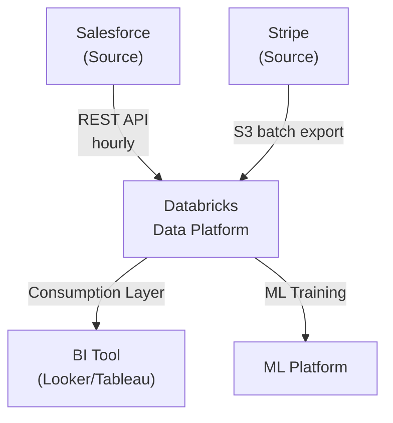
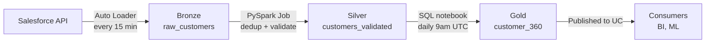

---
ddx:
  id: data-architecture
---

# Data Architecture

## Overview

[Describe the data product being architected, the business problem it solves, and the system context. Name the key data flows and Databricks platform fit. Reference the [[data-prd]] for the business requirements and success metrics this architecture must satisfy.]

### Scope

[What data flows and systems are covered by this architecture? What is deliberately outside the boundary? Which requirements from [[data-prd]] drive the design decisions?]

### System Context

| External System | Role | Protocol | Data Volume |
|-----------------|------|----------|------------|
| [e.g., Salesforce] | [Source system for customer data] | [REST API, batch export] | [M records/day] |
| [e.g., Data Warehouse] | [Consumer of aggregated data] | [Delta API, SQL] | [K rows/hour] |



## Medallion Topology

### Architecture Pattern

[Describe the medallion layer strategy: Bronze (raw), Silver (validated), Gold (consumption). For each layer, explain the transformation scope, quality gates, and consumer responsibilities.]

### Bronze Layer (Raw Ingestion)

**Purpose**: Land source data in its native form without transformation.

**Source Integration**:
- Source System: [e.g., Salesforce]
- Integration Pattern: [Auto Loader, Streaming Tables, scheduled batch import]
- Schema Validation: [Applied at ingestion, reject if schema mismatch]
- Retention: [e.g., 7 days rolling window for cost efficiency]

**Responsibilities**:
- Ingest all records from source
- Preserve source schema exactly (no column renames or type coercion)
- Tag records with `_ingest_timestamp` and source system identifier
- Detect and quarantine records that fail schema validation

**Quality Gates**:
- All records have `_ingest_timestamp` and source system id
- No truncation of source columns
- Fail fast if source unavailable for >4 hours

### Silver Layer (Validated and Transformed)

**Purpose**: Cleansed, deduplicated, and business-logic-ready data.

**Transformations**:
- Deduplication: [Method: e.g., "keep latest by timestamp", "PK uniqueness constraint"]
- Data type coercion: [e.g., "convert dates to ISO-8601, currency to numeric"]
- Null handling: [e.g., "fill defaults, or fail if critical column null"]
- Referential integrity: [e.g., "customer_id must exist in customer dimension"]

**Join Strategy**:
| Join | Left | Right | Type | Cardinality | Latency Impact |
|------|------|-------|------|-------------|---|
| [customer enrichment] | `customer_events` | `customer_master` | [Left Outer] | [1:1] | [Add 100ms] |

**Retention**: [e.g., 90 days]

**Responsibilities**:
- Enforce UNIQUE and NOT NULL constraints per data quality expectations
- Materialize aggregations needed for Gold layer
- Document row counts and latency metrics per transformation

**Quality Gates**:
- Zero duplicates (PK uniqueness)
- ≥99% NOT NULL on critical columns
- Row count reconciliation with source ±0.1%

### Gold Layer (Consumption)

**Purpose**: Business-ready tables optimized for consumer queries.

**Consumption Tables**:
| Table | Use Case | Consumers | Freshness | Aggregation |
|-------|----------|-----------|-----------|------------|
| `customer_360` | Single customer view, 360-degree profile | Analytics, ML | Hourly | None (deduped Silver) |
| `daily_sales_summary` | Daily revenue by product | Finance, BI | Daily | SUM(amount) by product_date |

**Optimization Strategy**:
- Partitioning: [e.g., "by date for date-range queries"]
- Z-order: [e.g., "on customer_id, product_id for filter selectivity"]
- Caching: [Materialized views for slow queries]

**Retention**: [e.g., 2 years for compliance and analytics]

**Responsibilities**:
- Keep Gold current with Silver ingestion cadence
- Publish schema and SLA via UC catalog comments
- Monitor query performance; alert if p95 latency > SLA

**Quality Gates**:
- Sums reconcile between Silver aggregates and Gold tables ±0.01%
- All customer IDs in Gold exist in Silver Silver
- Latency ≤SLA (e.g., ≤5 seconds for 90th percentile query)

## Data Flow

[Describe how data moves through the medallion layers. Clarify ingestion frequency, transformation latency, and refresh strategy.]

### Ingestion Flow



### Incremental vs Full Refresh

- **Bronze**: [Incremental via change data capture, or full reload?]
- **Silver**: [Incremental updates on specific key columns, or full recalc?]
- **Gold**: [Append-only fact tables, or snapshot updates?]

## Processing Semantics

### Streaming vs Batch Decision

| Layer | Strategy | Rationale | SLA Implication |
|-------|----------|-----------|-----------------|
| Bronze | [Streaming / Batch / Incremental Batch] | [Why this choice?] | [Freshness achieved] |
| Silver | [Streaming / Batch / Incremental Batch] | [Why this choice?] | [Freshness achieved] |
| Gold | [Streaming / Batch / Incremental Batch] | [Why this choice?] | [Freshness achieved] |

### Processing Framework

- **Framework**: [Databricks SQL, PySpark, dbt on Databricks, Streaming Tables]
- **Orchestration**: [Databricks Workflows, Airflow, dbt Cloud]
- **Failure Handling**: [Retry policy, dead-letter queue, manual intervention?]

### Latency and Throughput Targets

| Stage | Target Latency | Target Throughput | Constraint |
|-------|-----------------|-------------------|-----------|
| Salesforce → Bronze | ≤15 minutes | 1M records/day | API rate limit: 100 req/min |
| Bronze → Silver | ≤30 minutes | 1M records/day | PySpark cluster size |
| Silver → Gold | ≤2 hours | 100K aggregates/day | SQL query complexity |

## Quality Contracts

[Define expectations as testable EXPECT clauses per Databricks SDP. Each expectation binds the architecture: data violating it is rejected before reaching consumers.]

### Bronze Layer Expectations

```sql
-- Raw data must match source schema exactly
EXPECT TABLE raw_customers (
  customer_id NOT NULL,
  email NOT NULL,
  created_at TIMESTAMP NOT NULL,
  _ingest_timestamp TIMESTAMP NOT NULL GENERATED ALWAYS AS (CURRENT_TIMESTAMP())
);
```

- **Expectation**: All records ingested within 15 min of source commit
- **Violation**: Alert; do not advance to Silver
- **SLA**: Detect within 5 minutes

### Silver Layer Expectations

```sql
-- Customers must be unique per customer_id, deduplicated by latest timestamp
EXPECT TABLE customers_validated (
  customer_id NOT NULL,
  PRIMARY KEY (customer_id),
  UNIQUE (customer_id)
);

-- Customer email addresses must be normalized and not null
EXPECT TABLE customers_validated (
  email NOT NULL LIKE '%@%.%'
);
```

- **Expectation**: ≥99% NOT NULL on `email` and `phone`
- **Expectation**: Zero duplicate customers (PK uniqueness)
- **Violation**: Quarantine; manual review before advancing to Gold

### Gold Layer Expectations

```sql
-- Customer 360 must be current within freshness SLA (1 hour)
EXPECT TABLE customer_360 (
  MAX(_modified_at) >= CURRENT_TIMESTAMP() - INTERVAL 1 HOUR
);

-- Revenue aggregates must reconcile with Silver within 0.01%
EXPECT TABLE daily_sales_summary
  CHECK (
    SELECT SUM(amount) FROM daily_sales_summary 
    IS WITHIN 0.01% OF 
    SELECT SUM(amount) FROM customers_validated
  );
```

- **Expectation**: Customer 360 is no older than 1 hour
- **Expectation**: Daily sales sums reconcile with Silver ±$0.01 per order
- **Violation**: Reject; roll back to prior snapshot; alert on-call

### Cross-Layer Data Contracts

| Contract | Assertion | If Violated |
|----------|-----------|------------|
| [Bronze → Silver row count] | [Silver row count ≤ Bronze + 10% for dedup] | [Alert + manual audit] |
| [Silver → Gold cardinality] | [Gold unique customers = Silver unique customers] | [Reject until reconciled] |
| [Foreign key integrity] | [All orders.customer_id exist in customer_360] | [Quarantine order; alert] |

## Governance and Access Control

### Identity and Access Management

| Role | Catalog | Schema | Table | Permissions |
|------|---------|--------|-------|------------|
| Data Engineer | `prod` | `customer_360` | All | READ, MODIFY, EXECUTE |
| Analytics Lead | `prod` | `customer_360` | `customer_360`, `daily_sales_summary` (Gold only) | SELECT |
| Finance Team | `prod` | `customer_360` | `daily_sales_summary` | SELECT (date ≥ 2 years ago) |

### Data Classification and Retention

| Table | Classification | Sensitive Columns | Retention | Masked For |
|-------|------------------|------------------|-----------|-----------|
| `raw_customers` | Internal | `ssn`, `credit_card` | 7 days | [Not masked; only admins see] |
| `customers_validated` | Internal | `email`, `phone` | 90 days | [Non-PII audiences mask these] |
| `customer_360` | Internal | `email` | 2 years | [Mask for BI tool] |

### Fine-Grained Access Control

- **Row-Level Security**: [Do analytics users see only their region's data? Document the policy.]
- **Column-Level Security**: [Which sensitive columns are masked for which roles?]
- **Dynamic Views**: [Use UC masking functions to redact PII per caller role?]

## Databricks Platform Design

### Catalog Organization

```
prod (Catalog)
├── customer_360 (Schema)
│   ├── raw_customers (Bronze table)
│   ├── customers_validated (Silver table)
│   ├── customer_360 (Gold table)
│   └── daily_sales_summary (Gold aggregate)
├── metadata (Schema)
│   ├── pipeline_runs (audit log)
│   └── quality_metrics (expectations results)
```

### Compute Strategy

| Workload | Compute Tier | Cluster Size | DBU Budget | Rationale |
|----------|--------------|--------------|------------|-----------|
| Bronze ingestion (streaming) | All-purpose | 4 workers (i3.xlarge) | 8 DBU/hour | Continuous streaming |
| Silver transformation (batch) | Jobs | 8 workers (i3.2xlarge) | 16 DBU/run | Scheduled nightly |
| Gold aggregation (query) | Serverless SQL | N/A | ~5 DBU/query | Ad-hoc BI queries |

**Cost Optimization**:
- Spot instances for non-critical workloads: 30% savings
- Auto-terminate idle clusters: reduce waste
- Partition pruning and z-order for faster queries: reduce scans

### Storage Strategy

| Layer | Format | Compression | Optimization |
|-------|--------|-------------|--------------|
| Bronze | Delta | Snappy | Partitioned by date (rolling 7-day window) |
| Silver | Delta | Snappy | Z-ordered by customer_id, product_id |
| Gold | Delta | Snappy | Partitioned by date; cached for BI queries |

**Storage Sizing**: ~500 GB Bronze, ~50 GB Silver, ~5 GB Gold (monthly) → ~$25/month at $0.023/GB/month

### Databricks Features in Use

| Feature | Use Case | Configuration |
|---------|----------|---------------|
| Auto Loader | Salesforce → Bronze incremental ingestion | Cloud file location: S3, Schema inference enabled |
| Streaming Tables | Bronze → Silver continuous transformation | Trigger: arrival, 30-second max latency |
| Delta Live Tables | End-to-end medallion pipeline orchestration | Refresh: hourly for Bronze/Silver, daily for Gold |
| Unity Catalog | Governance, lineage, fine-grained access | Enable open sharing across teams |

## Decisions and Tradeoffs

### Key Architecture Decisions

| Decision | Choice | Rationale | Alternative Considered | Consequence |
|----------|--------|-----------|------------------------|------------|
| [Medallion layers] | [Bronze/Silver/Gold] | [Standard Databricks pattern for quality gates] | [Flat schema, 2-layer] | [Slower queries if using Bronze directly; quality risk] |
| [Streaming vs Batch for Silver] | [Batch nightly] | [Simplicity, cost] | [Streaming] | [1-2 hour stale window; acceptable for reporting] |
| [Compute tier for Gold queries] | [Serverless SQL] | [Cost & elasticity; no cluster mgmt] | [All-purpose cluster] | [Higher per-query cost; simpler ops] |

### Performance vs Cost Tradeoffs

- **Real-time ingestion** (streaming Bronze): Freshness ≤5 min, but 40% higher DBU cost
- **Materialized Gold aggregates**: Faster queries (100ms), but 20% higher storage cost
- **Spot instances for Silver jobs**: 30% cheaper, but risk of interruption (retry handles it)

### Known Risks and Mitigations

| Risk | Mitigation |
|------|-----------|
| [Salesforce API rate limit causes ingestion backlog] | [Implement exponential backoff; buffer in queue; alert if >1 hour backlog] |
| [PII in Bronze accessible to all engineers] | [Mask sensitive columns in published views; audit access logs] |
| [Schema drift in source breaks ingestion] | [Schema registry; auto-detect new columns; manual approval before Silver] |

---

## Review Checklist

Use this checklist during review to validate that the data architecture is complete and ready for implementation:

- [ ] **Scope** clearly states which data flows are included and which are out of bounds
- [ ] **Medallion Topology** defines Bronze, Silver, Gold layer purposes and transformation rules
- [ ] **Data Flow diagrams** (mermaid) show how data moves through layers and to consumers
- [ ] **Processing Semantics** explicitly state streaming vs batch for each layer with latency targets
- [ ] **Quality Contracts** are written as executable EXPECT clauses (SDP, dbt, SQL constraints)
- [ ] **Failure Handling** specifies what happens when an expectation fails (alert, reject, quarantine)
- [ ] **Access Control** model covers identity, row-level, column-level, and sensitive data masking
- [ ] **Databricks Platform Design** names catalog, schema, compute tier, storage strategy, and DBU budget
- [ ] **Decisions and Tradeoffs** document key choices with rationale and alternatives considered
- [ ] **Cross-layer data contracts** are defined (sums reconcile, cardinality stable, no orphans)
- [ ] **SLA per layer** is documented (freshness, latency, availability targets)
- [ ] No `[TBD]`, `[TODO]`, or `[NEEDS CLARIFICATION]` markers remain
- [ ] Architecture aligns with requirements in [[data-prd]] and can satisfy success metrics
- [ ] References link to [[data-quality-expectations]] for detailed EXPECT clauses per layer
